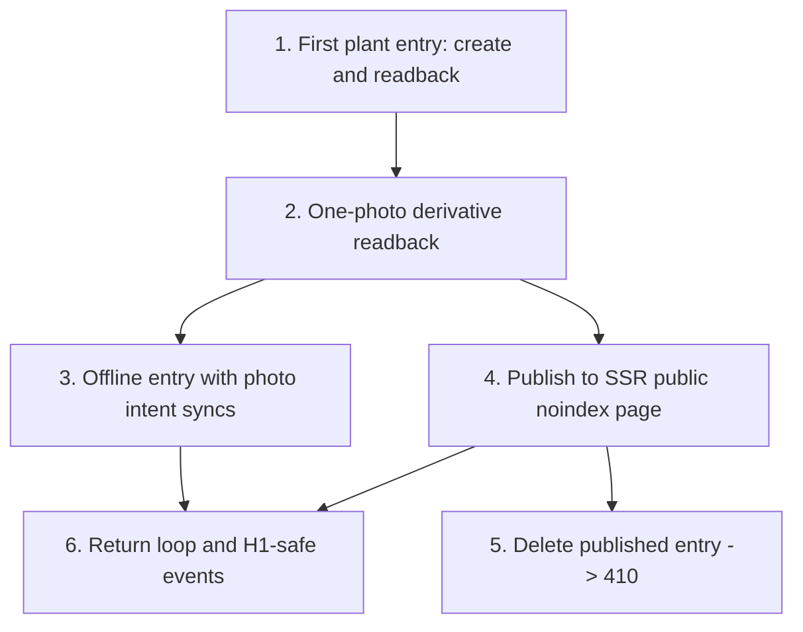

# SDD Vertical Slice Roadmap

Status: living execution roadmap
Date: 2026-06-26
Last operational update: 2026-07-15 (canonical catalog-match approval contract)
Owner: founder
Repo source of truth: `AGENTS.md`, `docs/TECH_STACK_DECISIONS.md`, `docs/adr/ADR-0014-agentic-stack-realignment.md`, `docs/WALKING_SKELETON.md`, `docs/SCAFFOLD_STATUS.md`, `docs/INFRASTRUCTURE_REGISTRY.md`, `docs/product-research/README.md`

This is not the full product backlog. It is the living execution roadmap for the next product-learning slices after the walking skeleton. The skeleton proved the stack; it is not product UI and it is not the final product data model.

From this point forward, work must be shipped as narrow vertical SDD slices that wire one user behavior end to end: SQL/types -> scoped repository -> route/action/API -> UI -> background job/search/media if relevant -> tests -> docs. A task that only creates schema, only builds UI, only wires media, or only adds instrumentation is not a valid execution slice unless it is embedded inside a user-visible path and proves integration through that path.

## Current Execution State

The active UI/UX/IA reconstruction queue is Linear project `SDD Slice 18 - Drive2-Parity Product Reconstruction` (`OVE-172` through `OVE-186`). It directly rebuilds production routes; there is no separate clickable-prototype phase. `OVE-172` provides the shared guest/authenticated shell, typed route configuration, minimum session variant, responsive navigation, explicit loading/error/404/410 states, and matched Drive2/OverGarden visual evidence gate. `OVE-173` provides the guest-open root feed through a privacy-minimized public repository, explicit kind/trusted-topic filters, stable cursor pagination, mixed-media journal cards, authenticated-only followed access, route-owned context modules, localized edge states, centralized UGC-feed noindex/sitemap exclusion, and matched desktop/mobile visual proof. `OVE-174` provides the shared mutation-time auth boundary: all eight guest mutation classes use one allowlisted encrypted intent, public reads remain session-free, email and social sign-in share the exact resume callback, cancel/expiry/tampering fail safely, canonical mutations independently reauthorize, and the resumed route focuses the interrupted control without carrying draft or private payloads. `OVE-175` provides the guest-open living-object catalog with real grouped taxonomy, URL-owned kind/identity/search filters, canonical pagination, public-safe object evidence, localized states, and deterministic visual thresholds. `OVE-176` provides the guest-open journal directory with canonical Postgres filtering, optional UUID-only Meilisearch relevance hints, kind/catalog/topic/season/coarse-region filters, stable URL state through journal detail and back, bounded derivative media, and deterministic ordered-query evidence. `OVE-177` provides the guest-open localized knowledge hub, authored guides/answers, curated topics, explicit editorial-versus-UGC trust states, explainable topic/catalog evidence, and public journal/object continuation without an authentication prompt. `OVE-178` provides one shared living-object passport presentation contract backed by separate public-safe and owner-scoped loaders, kind-specific identity/context facts, bounded derivative media, chronological journal disclosure, previous/next navigation, mutation-time authentication, owner controls, and hard public `404/410` lifecycle handling. `OVE-179` rebuilds public journal entry readback around lifecycle-safe object/space context, media, chronology, and mutation-time engagement. `OVE-180` rebuilds public and owner gardener profiles around living-object and journal evidence with scoped relationship controls. `OVE-181` replaces the former settings-like garden page with an owner-scoped operational workspace: one next action, mixed inventory, spaces, recent continuity, browser-local drafts, sync/media recovery, and bounded disclosures inside the shared shell; guest entry remains reversible and read-open until a write intent. `OVE-182` rebuilds first-object and next-update creation as low-friction plant/animal/bee flows with existing-space reuse, progressive optional detail, private-first publication, durable owner-scoped drafts/offline retries, bounded derivative media, and canonical idempotency under concurrent retries.

`OVE-183` completes the in-product return loop with guest-readable chronological comments/replies, exact mutation-time auth resume, profile/object/topic follows, a public-only chronological followed feed, private bookmarks/wishlist, code-owned notification summaries with explicit category preferences, and report/block controls whose two-way block predicate removes actors from every affected read model.

`OVE-184` adds the first moderated thematic community without opening user-created groups. Guests can read `/communities` and the `observation-and-care` overview, rules, aggregate membership/object counts, and canonical public-journal stream; authentication appears only for joining, contributing, reporting, or blocking and returns to the exact preserved control and filtered page. Signed-in members explicitly join/leave and contribute an existing eligible public journal by reference rather than copying its content. Archived communities preserve safe canonical evidence and allow an existing member to leave without accepting a join or contribution. Moderator-only actions reauthorize against an active assignment, remove or restore only the community projection, close discussions or participation, ban members, resolve reports, and append bounded audit events. Unknown or draft lifecycle lookup returns a hard localized `404`, all community/profile surfaces remain `noindex`, two-way blocks plus active-profile, ownership, and canonical publication predicates suppress unsafe rows, and navigation appears only after active rules, moderator, curated topic, open participation, and a real public contribution satisfy readiness.

`OVE-185` hardens the complete OVE-173 through OVE-184 journey for mobile, keyboard, screen reader, large-text, reduced-motion, and desktop use without creating alternate mobile data or authorization paths. Its matrix is derived from the unchanged OVE-187 v8 manifest and binds 171 stable scenarios across thirteen archetypes to 320px and 1440px, with dense and high-risk states additionally exercised at 360px, 390px, 640px 200%-reflow equivalence, 768px, 1024px, and 1280px for 642 route/viewport checks. The gate fails on horizontal overflow, offscreen controls, missing landmarks/headings, duplicate IDs, browser errors, critical/serious Axe findings, broken keyboard focus containment/return, inaccessible auth intent, lost report/block controls, reduced-motion regressions, or 200% text scaling that removes creation controls. Shared shell, shadcn Button, composer, workspace, passport, profile, community, feed, catalog, journal, knowledge, and social corrections preserve route parity and privacy controls; the browser harness refuses Production and uses only redacted manifest evidence.

`OVE-186` is the final integration and production-proof gate for Slice 18. `pnpm drive2:closeout:check` binds the unchanged OVE-187 v8 hash to all 171 scenarios, 642 route/viewport checks, thirteen archetypes, required state classes, plant/animal/bee coverage, every auth-intent action, and explicit guest/authenticated journey scenarios; CI fails on any missing dimension. `pnpm drive2:closeout:report` emits the redacted machine-readable route/state matrix with current commit and environment class. `pnpm smoke:drive2-production` separately proves canonical guest reads, public passport/journal/profile continuation, representative mutation-time authentication, Production fixture refusal, sitemap/public-HTML isolation, no-store privacy, locale foundations, and exact tested/deployed SHA equality. The binding runbook is `docs/DRIVE2_PARITY_PRODUCTION_CLOSEOUT.md`; deterministic fixtures never substitute for real production smoke, and OVE-188 remains a hard closeout blocker until its default-A1 and Cisco resolver gates pass.

`OVE-187` remains the production-refusing visual-data prerequisite for the reconstruction: its v8 manifest deterministically seeds real repositories and routes with 8 profiles, 10 spaces, 30 mixed living objects, 81 journals, 16 generated raster derivatives, 7 curated topics, 40 accepted public signals, 24 comments/replies, 16 bookmarks, 8 direct follows, 2 comment reports, 2 notification receipts, 2 preference rows, 14 wishlist items, 4 communities, 9 rules, 14 memberships, 4 moderators, 24 canonical community contributions, 1 community report, and 1 audit event. Its evidence owns 11 journal-directory URL/count/ordered-ID cases, 10 knowledge entry/object cases, 14 public/owner passport cases, 17 journal-entry cases, 10 profile cases, 8 owner-workspace cases, 15 social return-loop cases, 18 community cases, 20 resettable OVE-182 creation cases, and 21 credential-free OVE-174 intent scenarios. The verifier uses canonical SQL/loaders, repairs bounded fixture mutation artifacts, preserves unrelated local records, and requires loopback database and object-store/public-media endpoints. Continue from the current Linear blocker order; every remaining production behavior must use this fixture environment for desktop/mobile evidence instead of approving empty or one-record screens. The operator contract is `docs/VISUAL_FIXTURE_ENVIRONMENT.md`.

The earlier project `SDD Slice 15 - Drive2 Pattern Audit And Living-Journal Redesign` is superseded. `OVE-145` through `OVE-147` remain the completed research/synthesis record, and `OVE-148` through `OVE-150` remain historical completed implementations, but none of those completed cards is current visual approval. `OVE-151` through `OVE-156` are canceled with direct replacement relations to Slice 18.

Localization foundations `OVE-164` and `OVE-165` remain completed and must not regress. `docs/LOCALIZATION_COVERAGE_BASELINE_2026-07-14.md` records the additional localized contracts already shipped by OVE-172 through OVE-185 and is the binding do-not-rebuild boundary. The remaining cards are incremental delta slices, not full-surface rewrites: `OVE-166` depends only on `OVE-164`; `OVE-167` depends on `OVE-164` and the final gardener typeahead/readback contract in `OVE-161`; `OVE-168` depends on `OVE-164`, `OVE-165`, and `OVE-161`; `OVE-169` depends on `OVE-164` and `OVE-165`; and `OVE-170` depends on `OVE-164` plus the complete operator matching rollout in `OVE-163`. `OVE-171` is the final machine-checkable localization gate blocked directly by `OVE-166` through `OVE-170`, with `OVE-161` and `OVE-163` inherited transitively. `OVE-186` and `OVE-188` do not block those localization slices. If localization commits land before `OVE-186` closes, its exact-SHA CI, deployment, production-smoke, and protective-DNS evidence must be rerun against the new final `main` commit.

The deterministic catalog-matching queue `OVE-158` through `OVE-163` now includes the completed OVE-158 advisory worker/read-model contract and OVE-159 explicit canonical-match decision contract in `docs/CATALOG_MATCH_SUGGESTION_QUEUE.md`. Provisional saves enqueue privacy-safe off-request matching; evidence alone cannot mutate canonical state. A curator can approve one current suggestion through an atomic merge/object-update/audit/reindex transaction while journal rows remain unchanged, or reject only that suggestion with a bounded reason and no product-state mutation. Alias-bound semantic fingerprints fail closed without treating timestamp-only importer touches as new evidence, concurrent object creation is serialized against approval, and unchanged rejected evidence cannot immediately resurface. Continue with OVE-160 before OVE-161; OVE-162 also depends on OVE-158, and OVE-163 remains the combined matching rollout gate. OVE-170 must localize the final OVE-163 surface rather than freezing the interim English operator copy.

Execution Batch 1 and the original Slice 1-7 roadmap text below are historical implementation guidance, not the active Linear queue. The active MVP scope reconciliation and follow-up queue is Linear `OVE-114` through `OVE-139`. `OVE-114` is the docs reconciliation anchor; `OVE-115` through `OVE-139` are the vertical follow-up slices that convert the 2026-07-03 founder/operator MVP decision into product behavior.

Before selecting or starting any next Linear issue, run:

```bash
cd apps/web
pnpm mainline:closeout:check
```

Then read `docs/MAINLINE_CLOSEOUT.md`. As of OVE-50, the critical OVE-29 and OVE-30 fixes that were branch-only during the 2026-06-29 audit are proven on current `main` by `docs/mainline-closeout-ledger.json`. OVE-53 has founder-provided redacted field-run evidence recorded in Linear and is closed: 8 invited, 8 started, 8 first entries, and 6 same-object follow-ups. Do not add raw participant identities, invite URLs, journal text, media keys, private screenshots, IP/user-agent, or precise location to repo docs.

The 2026-07-01 OVE-96 lineage/social graph post-MVP decision is superseded by the 2026-07-03 founder/operator decision recorded in `docs/MVP_SCOPE_RECHECK_2026-07-03.md`. Lineage/social graph is now MVP scope and must be planned as vertical SDD slices with the privacy/consent invariants from `docs/product-research/CROSS_USER_TRUST_AND_PRIVACY_SPEC_v0.md`. Current Linear coverage is OVE-122 through OVE-126 plus OVE-133 through OVE-135.

The previously queued Linear project `SDD Slice 9 - Catalog Source Ingestion And Canonical Seed` (OVE-55-64) remains valid catalog work, but it is no longer the automatic next queue while MVP-critical OVE-114 through OVE-139 are active. When Linear returns to Slice 9, start with OVE-55 live source verification, then proceed through source snapshot quarantine, UA official varieties, species backbone, alias promotion, breed proof, BG official variety proof, genebank long-tail candidates, attribution, and refresh/diff slices.

OVE-55 is the binding source-readiness gate for that project: later ingestion issues must link back to `docs/product-research/CATALOG_SOURCE_READINESS_MANIFEST.json` and may only consume sources according to the manifest verdicts.

Maintainer-requested operational runtime queue: Linear project `SDD Slice 11 - Apple Container Runtime Migration` (OVE-71-77) moves local containerized development to Apple Container first while retaining Docker only for documented CI/Linux/feature gaps. Treat this as an operational SDD exception: the behavior is founder/agent runtime proof, not a user-facing product path, and every remaining Docker surface must name why Apple Container does not fit. The binding fallback matrix is `docs/CONTAINER_RUNTIME_POLICY.md`.

## Current Baseline

The implemented skeleton already proves:

- Next.js App Router + TypeScript builds locally.
- Better Auth sign-up creates a session cookie.
- Kysely + Postgres repositories work through scoped server code.
- R2/MinIO quarantine upload and stripped WebP derivative processing work.
- Dexie/IndexedDB offline queue exists and is test-covered.
- Public-search document conversion refuses private skeleton entries.
- Python worker can consume the Postgres `job_queue`.
- Meilisearch Cyrillic typo proof passes locally.

Do not rebuild those proofs. Replace the skeleton surfaces with product behavior slice by slice.

## Binding Execution Rules

1. User/product precise location stays locked in v0. Do not store, send, log, index, render, or infer coordinates for OverGarden users, journal entries, media, analytics, public/search documents, operator evidence, or product UI. Product UI may offer `region` or `hidden`; it must not offer exact location. External catalog/source ingestion may preserve legally reusable occurrence/distribution coordinates only in isolated raw/source snapshot tables with provenance, license, and usage flags; those fields must not enter product-facing projections without a later explicit ADR and SDD slice.
2. Public photos are worker-created derivatives only. Originals go to private quarantine, are re-encoded/stripped/resized server-side, and are deleted after successful processing.
3. Browser code never receives broad database access. All user/private data goes through server APIs/actions and scoped repositories.
4. Kysely is the app data layer. SQL migrations are schema source of truth. Do not introduce Prisma, Drizzle, TypeORM, or a new ORM.
5. Scoped repositories are mandatory for user data. Kysely types do not protect against missing `user_id`, publication, or location predicates.
6. Search indexes public-safe documents only. Treat indexing as a privacy boundary.
7. Public editorial, landing, guide, and answer SEO/AEO pages may be SSR and indexable at MVP launch when they contain useful first-party content. Thin, unsafe, or UGC-derived surfaces, including UGC, variety, topic, lineage, and profile pages, stay `noindex` and out of sitemaps until explicit quality gates promote them.
8. Offline capture is honest: queue locally, show queued/syncing/failed/synced states, allow retry, and do not promise iOS background sync reliability.
9. Each Linear task must carry context files, invariants, data contract, target files, non-goals, acceptance criteria, and verification commands.
10. Linear tasks that touch media, DNS, production env, deployment, storage, or external services must include `docs/INFRASTRUCTURE_REGISTRY.md` and update it if provider values change.
11. User-facing Linear tasks must run the Product Thinking Gate in `docs/product-research/README.md`, include the relevant research files in `Context files`, and state the product assumption being tested.
12. Runtime tasks must prefer Apple Container over Docker for local containerized development on supported Macs. Docker is allowed only when Apple Container is unavailable or lacks the required feature, and the issue must name that gap using `docs/CONTAINER_RUNTIME_POLICY.md`.

## SDD Slice Test

Before creating or accepting any Linear task from this roadmap, run this test. If the answer to any required question is "no", the task is too horizontal and must be rewritten.

Required:

1. Does the task start with a concrete user behavior, not an implementation layer?
2. Does the task touch at least three product layers, normally including data, server boundary, UI, and tests?
3. Does it produce something the founder can manually try in the app, even if ugly?
4. Does it prove privacy/media/search/offline invariants through executable tests, not prose?
5. Does it declare what existing skeleton code it replaces or reuses?
6. Does it include a failure gate that would stop the slice from being marked done?
7. Does it cite the relevant product research and name the user job, motivation, trust concern, growth mechanism, or market assumption behind the behavior?

Allowed exceptions:

- A pure migration or infrastructure task is allowed only when it is a prerequisite for the same issue's user path, not as a standalone batch item.
- A spike is allowed only when the output is a decision and a patch to this roadmap, not production code.

Anti-patterns:

- `Create all schema tables`.
- `Build the composer UI`.
- `Add media pipeline`.
- `Add analytics events`.
- `Build public pages`.

Valid SDD slice shapes:

- `Create first plant entry -> server save -> authenticated readback -> scoped tests`.
- `Add one photo to entry -> quarantine upload -> derivative processing -> readback renders derivative -> EXIF test`.
- `Create entry offline -> retry sync -> same server entry via idempotency -> readback -> queue-state tests`.
- `Publish entry -> SSR public page -> noindex/location-safe metadata -> public search doc privacy test`.
- `Delete published entry -> public 410 -> search/index removal guard -> authenticated archive state`.

## Vertical Slice Strategy

The first real product bet was H1: will users sustain a useful narrative growing journal habit? The first slices therefore validated safe capture and readback before catalog breadth, SEO breadth, social graph, or monetization. After the 2026-07-03 MVP scope recheck, expansion into SEO/AEO, localization, full M:N journaling, composer friction, self-serve auth, and lineage/social graph is allowed only through the fresh vertical Linear slices in OVE-115 through OVE-139. Monetization remains post-MVP.

The fastest useful path is:

1. Authenticated user lands in a real workspace, not `/skeleton`.
2. User creates one space and one plant object with minimal catalog assumptions.
3. User writes a narrative entry with title + body, optional backdate, region/hidden location visibility, and one photo.
4. Entry can be queued offline and synced later with an idempotency key.
5. Server processes the photo derivative and deletes the original.
6. User can read the entry back in the app and, if published, on an SSR public route that leaks no precise location and remains `noindex`.
7. The system records privacy-safe events needed to evaluate activation and journal retention.

## Slice Roadmap

This section is a historical horizon and original roadmap reference, not the active queue by itself. Use `Current Execution State`, Linear, and `docs/MAINLINE_CLOSEOUT.md` before accepting the next issue. Later slices remain directional bets that must be rewritten into fresh vertical SDD tasks after current implementation friction and product learning are reviewed.

### Slice 1: Narrative Journal Capture

Goal: replace `/skeleton` with the first real H1 path: space -> object -> entry with one photo -> offline fallback -> SSR readback.

Primary user behavior: an authenticated gardener can create a minimal plant journal entry and trust that it is saved, photo-safe, recoverable from offline queue, and readable later.

Includes:

- Product tables for spaces, plant objects, journal entries, entry media, and first privacy-safe event rows.
- Real app route under the localized app shell. If localization routing is not ready, implement the route in a way that can move under `/{lang}/app` without changing domain code.
- Minimal object creation with `unknown` or free-text variety state. Do not build full catalog import in this slice.
- Narrative composer with title and body. No event type chips, no milestone taxonomy.
- Backdate as a first-class field.
- Location visibility limited to `region` or `hidden`.
- One-photo upload via existing quarantine -> derivative pipeline.
- Offline queue for entry payload and photo upload intent with idempotency.
- SSR readback in the authenticated app.
- Published entry SSR route remains `noindex` and location-safe.

Non-goals:

- Full catalog seed/import.
- Meilisearch typeahead beyond the existing proof.
- Lineage, follow, invite, claims, comments, likes, wishlist, payments.
- Production infrastructure provisioning.
- OAuth provider setup.
- Public index-promotion logic.

### Slice 2: Catalog Typeahead And Unknown Fallback

Goal: make plant-object creation feel fast without blocking H1 on full data licensing or full entity resolution.

Primary user behavior: user can select a likely variety/name, add a provisional one, or choose unknown without getting stuck.

Includes:

- Minimal catalog tables needed for plant-object association.
- Meilisearch-backed typeahead over seed/minimal internal data.
- Provisional catalog item queue for user-added names.
- Unknown fallback that preserves journal flow.
- Internal curation queue scaffold, not a polished admin product.

### Slice 3: Publication Safety And Deletion

Goal: make public-only content viable without privacy or GDPR footguns.

Primary user behavior: user understands the first publication moment, can delete/archive, and public routes respond correctly.

Includes:

- First-publication disclosure with logged text/version/timestamp.
- Archive and delete states.
- 410 Gone for deleted public URLs.
- Sitemap exclusion and `noindex` state wiring.
- No precise location anywhere in HTML, URL, metadata, logs, analytics, search docs, or image derivatives.

### Slice 4: Public Entry And Variety Aggregation

Goal: create the first crawlable-but-controlled public content surfaces after safety rails exist.

Primary user behavior: visitor can read a real public entry and navigate to a low-thinness variety page.

Includes:

- Public entry page.
- First variety aggregation page.
- Public-only Meilisearch documents.
- Thinness gate defaults to `noindex`.
- Schema metadata that does not expose precise location or PII.

### Slice 5: Retention Loop And Metrics

Goal: measure whether journal value survives beyond the first save.

Primary user behavior: user returns to the same object, reads a prior entry, and creates another entry.

Includes:

- `own_record_revisited` proxy event.
- Entry follow-up event on the same object in the same session.
- Basic progress moment after save.
- Privacy-safe metrics for activation, compose completion, photo usage, offline queue health, and publish rate.

### Slice 6: Lineage And Social Graph MVP

Current status: historical shape only. The 2026-07-01 OVE-96 post-MVP deferral is superseded by `docs/MVP_SCOPE_RECHECK_2026-07-03.md`; lineage/social graph is now MVP scope, but only through the fresh vertical Linear slices OVE-122 through OVE-126 and OVE-133 through OVE-135. Read `docs/LINEAGE_SCOPE_DECISION.md` for privacy and consent invariants before touching lineage or social graph work.

Goal: add cross-user defensibility without exposing another user's identity, location, or visibility beyond consented/public-safe settings.

Primary user behavior: user can attribute provenance, confirm/decline a claim, and see lineage without exposing another user's identity/location beyond their own settings.

Includes:

- Edge proposal/confirm/decline state machine.
- Claim inbox.
- Sort-mediated public artifacts only.
- Block/report/limits.
- Noindex full lineage graph.

Current non-goals for this historical roadmap text: do not revive Slice 6 wholesale or implement a schema-only/social-network-generic layer. Use the fresh Linear issues instead: provenance edge (OVE-122), claim inbox (OVE-123), invitations (OVE-124), graph readback/follow/ask-the-lineage (OVE-125/OVE-126), public-safe handles (OVE-133), cross-user mention/typeahead (OVE-134), and followed feed/notifications (OVE-135).

## Execution Batch 1

Historical note: Batch 1 has been superseded by later Linear slices. Keep this section for slice-shape reference only; do not restart from this batch or use it as the next active queue.

Create the first Linear batch from the issues below. Keep them in one project or milestone named `SDD Slice 1 - Narrative Journal Capture`. These are vertical execution slices, not layer tickets. Every issue owns the schema/server/UI/test/doc changes needed for its own user behavior.

Do not open a separate "schema task" or "UI task" for this batch. The first issue introduces the minimum product schema because it needs it to ship a real user path; later issues extend that schema only where their own path requires it.

### 1. First Plant Entry: Authenticated Create And Readback

User behavior: a signed-in gardener opens the real product workspace, creates one space, creates one plant object without full catalog dependency, saves a title/body entry, and sees it on the object page.

Why this is first: it replaces the skeleton with the smallest H1 journal loop. If this does not work end to end, photo, offline, public pages, and metrics are premature.

Context files:

- `AGENTS.md`
- `docs/product-research/README.md`
- relevant files selected through the Product Thinking Gate
- `docs/TECH_STACK_DECISIONS.md`
- `docs/adr/ADR-0014-agentic-stack-realignment.md`
- `docs/WALKING_SKELETON.md`
- `docs/SCAFFOLD_STATUS.md`
- `apps/web/sql/0001_walking_skeleton.sql`
- `apps/web/src/db/types.ts`
- `apps/web/src/server/journal-repository.ts`
- `apps/web/src/server/media/media-repository.ts`
- `apps/web/src/app/skeleton/page.tsx`
- `apps/web/src/app/skeleton/actions.ts`
- `apps/web/src/server/auth-session.ts`
- `apps/web/src/server/request-scope.ts`
- `apps/web/src/components/ui/button.tsx`

Invariants:

- No precise location fields or UI.
- Location visibility is `region` or `hidden` only.
- SQL migrations remain schema source of truth.
- User-owned reads/writes must go through scoped repositories.
- The route requires auth for write actions.
- The primary product path must be separate from `/skeleton`.

Data contract:

- Add the minimum product tables for `spaces`, `plant_objects`, and `journal_entries`.
- Space has `owner_user_id`, display name, and location visibility defaults. It does not store coordinates.
- Plant object has `owner_user_id`, `space_id`, display name, optional `variety_text`, `variety_state`, and location visibility. It does not require catalog tables.
- Journal entry requires `title`, `body`, `entry_scope`, `entry_date`, `client_mutation_id`, `owner_user_id`, and object/space reference.
- Object entry references exactly one object.
- Keep `job_queue` compatible with the existing worker pattern.

Target files:

- `apps/web/sql/*`
- `apps/web/src/db/generated.ts`
- `apps/web/src/db/types.ts`
- `apps/web/src/db/schema.ts`
- `apps/web/src/app/*`
- `apps/web/src/server/*repository.ts`
- `apps/web/src/components/*`
- focused repository tests near affected repositories
- `docs/SCAFFOLD_STATUS.md` or follow-up status note if commands change

Non-goals:

- Full catalog schema.
- Media upload.
- Offline queue.
- Public SSR route.
- Analytics event storage.
- Lineage/social graph tables.
- Production R2/DO setup.
- ORM changes.

Acceptance criteria:

- Local bootstrap applies the Slice 1 schema from a clean database.
- `pnpm db:types` regenerates Kysely types.
- Repository tests prove owner scoping and idempotent entry creation.
- A negative test proves a user cannot read another user's space/object/entry through repository methods.
- No new schema column stores precise location.
- Authenticated user can create/read one space, one plant object, and one title/body entry.
- Empty states guide directly to first object and first entry creation.
- UI copy is product language, not skeleton/debug language.
- The founder can manually try the path without using `/skeleton`.

Verification commands:

Current runtime note: this historical Docker Compose command is a fallback path. New local runtime work should prefer Apple Container per `docs/CONTAINER_RUNTIME_POLICY.md`.

```bash
cd infra && docker compose up -d
cd ../apps/web
pnpm local:bootstrap
pnpm db:types
pnpm lint
pnpm typecheck
pnpm test
pnpm build
```

Failure gate:

- Do not mark done if any acceptance criterion only works through `/skeleton`, if another user's data is reachable, or if a location column can hold coordinates.

### 2. One-Photo Entry: Quarantine To Derivative Readback

User behavior: a signed-in gardener adds one photo to a journal entry, the original goes through quarantine, the server creates a stripped WebP derivative, deletes the original, and the object page renders only the derivative.

Why this is second: photo is core to gardening evidence, but it is safety-critical. This slice must prove the full media path inside the real entry flow, not as a standalone media demo.

Implementation status (2026-06-26): implemented by `OVE-12` in the real `/garden` entry path. Verified with Cloudflare R2 upload/process/public-fetch smoke, derivative-only authenticated SSR readback, desktop/mobile browser checks, repository contract tests, media processor order test, lint, typecheck, full tests, and production build.

Context files:

- `docs/TECH_STACK_DECISIONS.md`
- `docs/product-research/README.md`
- relevant files selected through the Product Thinking Gate
- `docs/INFRASTRUCTURE_REGISTRY.md`
- `docs/WALKING_SKELETON.md`
- `apps/web/src/server/media/derivatives.ts`
- `apps/web/src/server/media/derivatives.test.ts`
- `apps/web/src/server/media/media-repository.ts`
- `apps/web/src/server/media/processor.ts`
- `apps/web/src/lib/storage.ts`
- Slice 1 product route/action/repository files from issue 1
- `apps/web/AGENTS.md`

Invariants:

- Public photo is only the stripped derivative.
- Quarantine original is deleted before the public derivative is written.
- Client-side stripping is optional optimization, never the safety boundary.
- Public URLs must never expose quarantine keys.
- Media reads/writes remain scoped to the owner.

Data contract:

- Extend product schema only as needed for entry media association.
- Entry can have one attached media asset in this slice.
- Media status must distinguish queued/quarantined, processed, and failed.
- Derivative URL/key is the only renderable public image reference.
- Quarantine key is server/internal and must not appear in public read models.

Target files:

- `apps/web/src/app/*`
- `apps/web/src/server/media/*`
- `apps/web/src/lib/storage.ts`
- `apps/web/src/server/*repository.ts`
- `apps/web/src/components/*`
- media, repository, and route/action tests

Non-goals:

- Multi-photo gallery.
- Video.
- Image editing.
- CDN production binding.
- Public SSR page.

Acceptance criteria:

- User can attach one photo while creating or editing an entry in the real product path.
- Processing creates WebP derivative without EXIF metadata.
- Original object is deleted before the derivative is exposed publicly.
- Entry readback renders only the derivative URL.
- Failed processing leaves a recoverable failed state, not a broken public image.
- User A cannot attach/read User B's media asset.

Verification commands:

Current runtime note: this historical Docker Compose command is a fallback path. New local runtime work should prefer Apple Container per `docs/CONTAINER_RUNTIME_POLICY.md`.

```bash
cd infra && docker compose up -d
cd ../apps/web
pnpm local:bootstrap
pnpm lint
pnpm typecheck
pnpm test
pnpm build
```

Failure gate:

- Do not mark done if any UI/public read model can display a quarantine key, if EXIF stripping is only client-side, or if readback can point at the original object.

### 3. Offline Entry With Photo Intent: Queue, Sync, No Duplicate

User behavior: a gardener starts an entry with title/body and one photo intent while offline, sees it queued, regains connection, retries sync, and ends with exactly one server entry plus safe media state.

Why this is third: offline capture matters only if it returns to the same canonical server path. This slice must prove offline does not fork the product model or create duplicates.

Implementation status (2026-06-26): implemented by `OVE-9` in the real `/garden` entry path. Verified with Dexie queue transition tests, offline sync tests for retry idempotency and retained photo intent, repository idempotency contracts, lint, typecheck, full tests, production build, and browser QA for offline queued entry -> retry -> authenticated readback with exactly one entry plus offline photo intent -> media processing -> derivative-only readback.

Context files:

- `docs/TECH_STACK_DECISIONS.md`
- `docs/product-research/README.md`
- relevant files selected through the Product Thinking Gate
- `docs/INFRASTRUCTURE_REGISTRY.md`
- `docs/WALKING_SKELETON.md`
- `apps/web/src/lib/offline/queue.ts`
- `apps/web/src/lib/offline/queue.test.ts`
- `apps/web/src/app/sw-register.tsx`
- Product route/action/media files from issues 1-2

Invariants:

- Offline state is visible and honest.
- Idempotency prevents duplicate entries after retry.
- Do not promise background sync reliability.
- Photo upload intent can be queued, but public derivative still requires server processing after connectivity returns.
- Server readback remains the source of truth after sync.

Data contract:

- Queue payload includes mutation kind, entry fields, object/space references, photo upload intent if present, idempotency key, and status.
- Sync transitions: queued -> syncing -> synced or failed.
- Failed mutations retain error text safe for UI display and retry.
- Retry submits the same `client_mutation_id`.

Target files:

- `apps/web/src/lib/offline/*`
- entry composer client components
- server action/API sync endpoint for the same product path
- repository/idempotency tests
- offline queue state transition tests

Non-goals:

- Conflict resolution beyond idempotent retry.
- Multi-device offline merge.
- Full service-worker background sync.
- Public SSR page.

Acceptance criteria:

- User can compose an entry while offline and see queued status.
- Retry sync submits the same idempotency key.
- Successful retry creates or updates exactly one server entry.
- Success updates UI to synced and shows server readback.
- Failure shows retry without losing body/title/photo intent.
- Tests cover queued/syncing/synced/failed paths and duplicate retry.

Verification commands:

```bash
cd apps/web
pnpm lint
pnpm typecheck
pnpm test
pnpm build
```

Failure gate:

- Do not mark done if offline success can only be observed in local state, if retry can create duplicates, or if failed sync loses the entry body/photo intent.

### 4. Publish Entry: SSR Public Page, Noindex, Public-Safe Search Document

User behavior: a gardener publishes an entry, confirms first-publication disclosure if needed, and a visitor can load an SSR public entry page that is `noindex`, location-safe, and uses only public-safe media/search data.

Why this is fourth: public pages are the growth engine, but they are also a privacy boundary. This slice forces publication, SSR, metadata, derivative media, and search-document rules to meet in one path.

Context files:

- `AGENTS.md`
- `docs/TECH_STACK_DECISIONS.md`
- `docs/product-research/README.md`
- relevant files selected through the Product Thinking Gate
- `docs/INFRASTRUCTURE_REGISTRY.md`
- `docs/adr/ADR-0014-agentic-stack-realignment.md`
- `docs/WALKING_SKELETON.md`
- `apps/web/src/server/search/documents.ts`
- `apps/web/src/server/search/documents.test.ts`
- Product route/action/media files from issues 1-3

Invariants:

- Published HTML, URL, metadata, search docs, and image data contain no precise location.
- Public page is server-rendered.
- Public page is `noindex` until later index-promotion logic exists.
- Public page renders derivative media only.
- Search document conversion indexes public-safe rows only.

Data contract:

- Entry has publication state, public slug, `noindex` state, and first-publication disclosure state if needed.
- Public read model contains title/body, coarse region or hidden location state, derivative media references, and author-safe display fields only.
- Search document contains no private fields, no quarantine keys, no raw location, and no title/body content from non-public entries.

Target files:

- public route under `apps/web/src/app/*`
- journal/search repositories
- metadata/noindex wiring
- first-publication action/UI if needed
- public-safe route/search tests

Non-goals:

- Variety aggregation page.
- Sitemap promotion.
- Comments, likes, follows.
- Organic-K reporting.

Acceptance criteria:

- User can publish an existing entry from the product path.
- Public SSR route renders the published entry and derivative photo.
- Public route emits `noindex`.
- Private/unpublished entries return not found or access-safe response from the public route.
- Public-safe search document excludes precise location, quarantine keys, owner-private fields, and non-public entries.
- First-publication disclosure is logged if this is the user's first publish.

Verification commands:

```bash
cd apps/web
pnpm lint
pnpm typecheck
pnpm test
pnpm build
```

Failure gate:

- Do not mark done if a public page can render private content, precise location, original/quarantine media, or indexable thin content.

Implementation status:

- Implemented in `OVE-8` with explicit authenticated publish from `/garden/objects/[objectId]`, entry-level publication state, first-publication disclosure fields, `/journal/[slug]` SSR readback, default `noindex` metadata, derivative-only public media selection, and public-safe search document tests.
- Product Thinking Gate files used: `docs/product-research/UA_summaries_all.md`, `docs/product-research/MVP_LOGGING_DESIGN-BRIEF.md`, `docs/product-research/OverGarden_B2_METRICS_v0.md`, and `docs/product-research/B5_SEO_CONTENT_ARCHITECTURE_v2.md`.
- Product assumption tested: publication can start the future UGC/SEO branch only if publishing is explicit, private-by-default journaling is preserved, precise location never reaches public HTML/metadata/search, and thin public pages remain `noindex`.

### 5. Delete Published Entry: 410 Gone And Archive State

User behavior: a gardener deletes or archives a published entry, the authenticated app shows the correct recoverable/private state, and the public URL returns 410 Gone with de-indexing safeguards.

Why this is fifth: public-only content is not safe without deletion semantics. This slice closes the loop opened by publication before broadening public surfaces.

Context files:

- `AGENTS.md`
- `docs/TECH_STACK_DECISIONS.md`
- `docs/product-research/README.md`
- relevant files selected through the Product Thinking Gate
- `docs/INFRASTRUCTURE_REGISTRY.md`
- `docs/WALKING_SKELETON.md`
- Public route/search files from issue 4
- Product repository/action files from issues 1-4

Invariants:

- Deleted public URL returns 410 Gone, not a soft 200.
- Deleted entry is removed from public/search read models.
- Authenticated archive/recoverable state does not make the public URL visible.
- Deletion does not weaken media derivative guarantees.
- Erasure-on-request is not fully implemented here, but the data model must not block it.

Data contract:

- Entry has lifecycle state that can represent active, archived/deleted, and public-gone.
- Public route can distinguish never-existed/not-public from deleted-public where needed.
- Search document conversion returns null for deleted/archived entries.

Target files:

- journal repository/action files
- public entry route
- archive UI state in the product workspace
- search document tests
- public route tests

Non-goals:

- Full account erasure.
- Search engine removal API integration.
- Sitemap generation.

Acceptance criteria:

- User can delete/archive a published entry from the authenticated workspace.
- Public URL for that entry returns 410 Gone.
- Deleted/archived entry does not produce a search document.
- Authenticated workspace can show recoverable archive state if archive is implemented.
- User A cannot delete/archive User B's entry.

Verification commands:

```bash
cd apps/web
pnpm lint
pnpm typecheck
pnpm test
pnpm build
```

Failure gate:

- Do not mark done if deletion only hides UI while the public route still returns 200, or if deleted content can still be indexed.

Implementation status:

- Implemented in `OVE-7` with entry lifecycle state, recoverable archived entries in authenticated readback, public-gone tombstones for previously published slugs, `/journal/[slug]` HTTP `410 Gone` responses, and search document exclusion for archived/public-gone rows.
- Product Thinking Gate files used: `docs/product-research/B5_SEO_CONTENT_ARCHITECTURE_v2.md`, `docs/product-research/CROSS_USER_TRUST_AND_PRIVACY_SPEC_v0.md`, `docs/product-research/OverGarden_MVP_PRD_v0.md`, and `docs/product-research/UA_summaries_all.md`.
- Product assumption tested: publishing is trustworthy only if the user can immediately remove public exposure while preserving their own private journal history for later recovery/erasure workflows.

### 6. Return Loop: Revisit Object, Add Second Entry, Emit H1-Safe Events

User behavior: a gardener returns to the same object, reads the previous entry, adds a second dated entry, and the system records privacy-safe activation/retention events without raw content or precise location.

Why this is sixth: the first save is not H1. The H1 proxy requires return behavior around the same object. This slice turns the capture path into a measurable retention loop.

Context files:

- `docs/TECH_STACK_DECISIONS.md`
- `docs/product-research/README.md`
- relevant files selected through the Product Thinking Gate
- `docs/WALKING_SKELETON.md`
- Product route/action/repository files from issues 1-5

Invariants:

- No precise coordinates, addresses, raw EXIF, email, IP-derived exact location, or PII in events.
- Events are secondary to product writes; event failure must not lose journal data.
- Metrics distinguish journal retention from publication/share vanity.
- No raw title/body content in event payloads.

Data contract:

- Events needed now: `space_created`, `object_created`, `entry_logged`, `entry_photo_attached`, `offline_entry_queued`, `offline_entry_synced`, `progress_screen_shown`.
- Add `own_record_revisited` and second-entry event linkage for the same object in the same session if session tracking exists.
- Event props may include booleans/enums only: `entry_scope`, `has_photo`, `is_backdated`, `location_visibility_level`, `sync_status`, `variety_state`.
- No raw body/title content in analytics events.

Target files:

- event repository/module
- server actions/API routes where events are emitted
- object page/readback UI where revisit is observed
- focused tests for privacy-safe payloads

Non-goals:

- PostHog integration.
- Dashboards.
- Organic-K or SEO reporting.
- Full cohort analytics.

Acceptance criteria:

- Product writes emit privacy-safe events after successful mutation.
- Reading a prior entry on the same object can emit a privacy-safe revisit event.
- Creating a second entry on the same object is distinguishable from first-entry activation.
- Event write failure is logged server-side but does not fail the user action.
- Tests reject event payloads containing forbidden location/content fields.
- Documentation states that event targets are provisional until live pilot calibration.

Verification commands:

```bash
cd apps/web
pnpm lint
pnpm typecheck
pnpm test
pnpm build
```

Failure gate:

- Do not mark done if H1 events contain title/body text, precise location, raw media metadata, email, or if event failure can block saving the entry.

## Batch 1 Dependency Graph



## Batch 1 Definition Of Done

Batch 1 is done when a new authenticated user can:

1. Open the real product workspace.
2. Create one space.
3. Create one plant object without full catalog dependency.
4. Save a narrative title/body entry with optional backdate and one photo.
5. Lose network before save, recover through retry, and avoid duplicates.
6. See the saved entry and stripped photo derivative in readback.
7. Generate only privacy-safe events.

The batch is not done if the flow only works through `/skeleton`, if public images can point to originals/quarantine keys, if any location field can store coordinates, or if another user's data can be reached through a repository/API path.

## Post-Batch Decision

After Batch 1, review real implementation friction before opening Batch 2. This was the correct historical sequencing guard. It is now superseded by the 2026-07-03 MVP scope recheck for current execution: do not use this paragraph to block OVE-115 through OVE-139, but keep its principle that every expansion must be a vertical SDD slice with executable privacy and quality gates.
