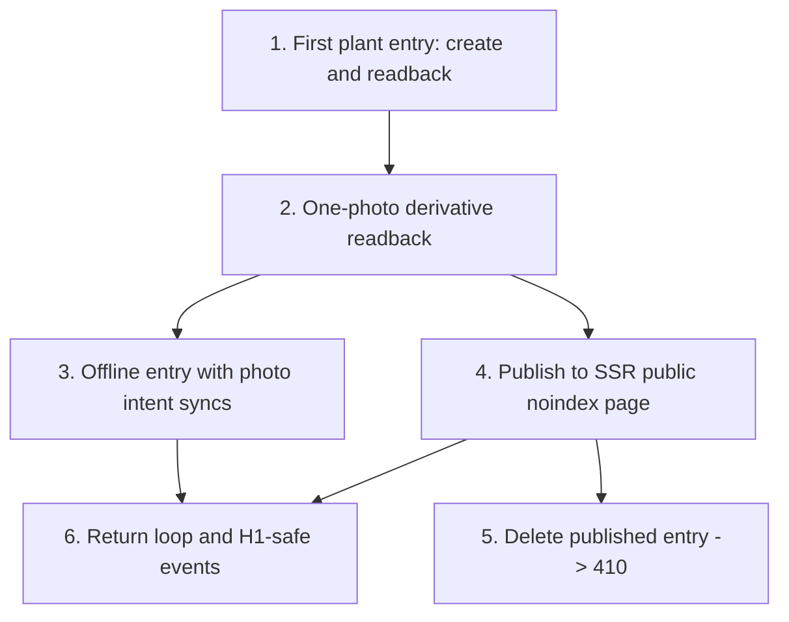

# SDD Vertical Slice Roadmap

Status: historical receipt. Not the active queue.
Current authority: `docs/adr/ADR-0022-owner-mvp-reset.md` and `AGENTS.md`.
Active work: Linear project "SDD Slice 21 - Owner MVP Reset" (OVE-362 through
OVE-373), read from Linear directly.

Everything below this line is the roadmap and execution log as it stood on
2026-08-25. It records what was built and why, including the earlier
offline-first, fail-closed, threshold-indexing, and governance decisions that
ADR-0022 replaced on 2026-09-02. Read it as provenance, never as instruction.

## Current Baseline

The implemented skeleton already proves:

- Next.js App Router + TypeScript builds locally.
- Better Auth sign-up creates a session cookie.
- Kysely + Postgres repositories work through scoped server code.
- R2/MinIO quarantine upload and stripped WebP derivative processing work.
- Historical implementation status: the Dexie/IndexedDB offline queue exists
  and is test-covered, but ADR-0017 makes it non-authoritative runtime residue
  owned by OVE-321 through OVE-323.
- Public-search document conversion refuses private skeleton entries.
- Python worker can consume the Postgres `job_queue`.
- Meilisearch Cyrillic typo proof passes locally.

Do not rebuild those proofs. Replace the skeleton surfaces with product behavior slice by slice.

## Binding Execution Rules

1. User/product precise location stays locked in v0. Do not store, send, log, index, render, or infer coordinates for OverGarden users, journal entries, media, analytics, public/search documents, operator evidence, or product UI. Product UI may offer `region` or `hidden`; it must not offer exact location. External catalog/source ingestion may preserve legally reusable occurrence/distribution coordinates only in isolated raw/source snapshot tables with provenance, license, and usage flags; those fields must not enter product-facing projections without a later explicit ADR and SDD slice.
2. Public photos are worker-created derivatives only. Originals go to private quarantine, are re-encoded/stripped/resized server-side, and are deleted after successful processing.
3. Browser code never receives broad database access. All user/private data goes through server APIs/actions and scoped repositories.
4. Kysely is the app data layer. SQL migrations are schema source of truth. Do not introduce Prisma, Drizzle, TypeORM, or a new ORM.
5. Scoped repositories are mandatory for user data. Kysely types do not protect against missing `user_id`, publication, or location predicates.
6. Search indexes public-safe documents only. Treat indexing as a privacy boundary.
7. Public editorial, landing, guide, and answer SEO/AEO pages may be SSR and indexable at MVP launch when they contain useful first-party content. Thin, unsafe, or UGC-derived surfaces, including UGC, variety, topic, lineage, and profile pages, stay `noindex` and out of sitemaps until explicit quality gates promote them.
8. **Network-required saves are honest.** ADR-0017 forbids new durable browser
   journal writes, offline queues, PWA shell/installability promises, and
   `navigator.onLine` as a success oracle. Only an acknowledged server response
   establishes success; network uncertainty yields
   `network_unavailable_save_refused`.
9. Every new or materially rewritten Linear work item must conform to `docs/LINEAR_AI_EXECUTION_TASK_STANDARD.md`, use `docs/linear/AI_AGENT_EXECUTION_ISSUE_TEMPLATE.md`, and pass `pnpm linear:task:check` before Linear write and after exact-description read-back. Links and parent issues never replace the task-local execution contract.
10. Linear tasks that touch media, DNS, production env, deployment, storage, or external services must include `docs/INFRASTRUCTURE_REGISTRY.md` and update it if provider values change.
11. User-facing Linear tasks must run the Product Thinking Gate in `docs/product-research/README.md`, include the relevant research files under the exact `Required context` heading, and state the product assumption being tested.
12. Runtime tasks must prefer Apple Container over Docker for local containerized development on supported Macs. Docker is allowed only when Apple Container is unavailable or lacks the required feature, and the issue must name that gap using `docs/CONTAINER_RUNTIME_POLICY.md`.

## SDD Slice Test

Before creating or accepting any Linear work item from this roadmap, first select its issue kind under `docs/LINEAR_AI_EXECUTION_TASK_STANDARD.md`, then run the common questions and the applicable kind-specific test. Any required "no" keeps the item in draft and requires a rewrite. Layer count is a diagnostic, not a target: never invent UI, schema, or provider work to make a task look vertical.

Required for every issue kind:

1. Does the task start with one observable user or operator outcome rather than a component/layer inventory?
2. Does it pin dated evidence and a 40-character baseline SHA while requiring fresh current-main, current-Linear, caller, dependency, and provider read-back before execution?
3. Does it declare one canonical owner for every shared policy/state/effect and prove that its blocker graph is acyclic?
4. Does it make every affected privacy, authorization, data, lifecycle, external-effect, failure, and recovery invariant exact and executable?
5. Does each measurable acceptance criterion map to a named test, command, exact-SHA receipt, provider read-back, or authorized observation?
6. Does it define migration/compatibility/rollout/rollback/cleanup, concrete failure gates, and the evidence that forbids premature `Done`?
7. Does it preserve task-local decisions instead of outsourcing them to a link, parent issue, prior chat, or implementing agent?
8. Does it pass `cd apps/web && pnpm linear:task:check -- --file ../../path/to/issue.md --phase final` before write and after saved-description read-back?

Additional test for `vertical_execution`:

1. Is one concrete gardener/visitor/moderator behavior the organizing outcome?
2. Does the issue own every affected layer necessary for end-to-end proof, normally at least three non-test/documentation layers?
3. Can the user behavior be exercised through the actual UI/browser, including the market-valid locale matrix, keyboard/accessibility, degraded, retry, and recovery states?
4. Did the Product Thinking Gate select 2–5 genuinely relevant research files and name the user job, load-bearing assumption, and falsification signal?

Additional test for `remediation`:

1. Is the failure safely reproducible or explicitly bounded as a proof gap?
2. Is the closest enforceable failing boundary named, with every caller/bypass and the complete affected journey inventoried?
3. Do regression, negative, fault/race, performance, and recovery proofs demonstrate the actual defect is gone without weakening preserved controls?

Additional test for `operator_execution`:

1. Is there a concrete operator outcome, protected product invariant, bounded blast radius, environment identity, and immutable read-back receipt?
2. Are classify/plan/apply/verify/rollback/cleanup phases, approval gates, drift refusal, idempotency, external partial-success handling, and post-effect convergence explicit?
3. Does the issue explain why the work is safer as a standalone operator behavior than inside a product slice, without adding fake UI?

Additional test for `decision_spike` or `canon_correction`:

1. Is the output bounded to named evidence, a decision/authority resolution, exact canon consumers, and a falsification/reopen condition?
2. Does the task explicitly forbid silent production behavior and name every stale reference that must be removed or preserved as historical context?
3. Is the time/decision boundary strict enough that implementation cannot hide inside the investigation?

Additional test for `coordination_container`:

1. Is the container explicitly non-executable and unassigned, with no branch, implementation, deployment, or production mutation path of its own?
2. Does every executable child have its own complete validated contract, owner, dependency relations, rollout, rollback, verification, and closeout evidence?
3. Is the child graph acyclic, and does the container define the integration read-back required to close only after every child is independently complete?

Valid bounded exceptions:

- A localized remediation may touch fewer than three production layers when the issue proves why one enforceable boundary repairs the complete journey.
- Migration, infrastructure, provider, release, backup/restore, and production-proof work may be standalone `operator_execution` tasks when they satisfy the operator test above.
- A decision spike may ship only its evidence/decision/canon update; subsequent production behavior requires a fresh execution issue.
- A canon correction may be documentation-only when it names contradictory authorities, resolves ownership, inventories every consumer, and proves stale-reference removal.

Anti-patterns:

- `Create all schema tables`.
- `Build the composer UI`.
- `Add media pipeline`.
- `Add analytics events`.
- `Build public pages`.
- `Upgrade the provider` without environment, plan, approval, read-back, rollback, and protected product behavior.
- `Investigate the freeze` without a bounded hypothesis matrix, stop conditions, performance budgets, and a follow-up decision contract.

Valid SDD slice shapes:

- `Create first plant entry -> server save -> authenticated readback -> scoped tests`.
- `Add one photo to entry -> quarantine upload -> derivative processing -> readback renders derivative -> EXIF test`.
- `Create entry while the network request is unavailable -> refuse false save -> retry the same server-authoritative idempotency key -> one readback -> failure-state tests`.
- `Publish entry -> SSR public page -> noindex/location-safe metadata -> public search doc privacy test`.
- `Delete published entry -> public 410 -> search/index removal guard -> authenticated archive state`.

## Vertical Slice Strategy

The first real product bet was H1: will users sustain a useful narrative growing journal habit? The first slices therefore validated safe capture and readback before catalog breadth, SEO breadth, social graph, or monetization. After the 2026-07-03 MVP scope recheck, expansion into SEO/AEO, localization, full M:N journaling, composer friction, self-serve auth, and lineage/social graph was routed through the then-created vertical Linear slices OVE-115 through OVE-139. That batch is historical; monetization remains post-MVP.

The fastest useful path is:

1. Authenticated user lands in a real workspace, not `/skeleton`.
2. User creates one space and one plant object with minimal catalog assumptions.
3. User writes a narrative entry with title + body, optional backdate, region/hidden location visibility, and one photo.
4. Before Publish, text and media orchestration are tab-memory only; the browser
   creates and previews the exact final WebP and stages those bytes directly to
   private Cloudflare storage through a narrow capability.
5. Publish is network-required and freezes one exact document/media snapshot.
   A server-authoritative idempotency key produces one atomic public record or
   reports `network_unavailable_save_refused` when acknowledgement is unavailable.
6. User reads the complete entry back in the app and on its SSR public route;
   no pending media, precise location, source original, or staging identity is
   observable, and discoverability remains governed by the measured threshold.
7. The system records privacy-safe events needed to evaluate activation and
   journal retention.

## Slice Roadmap

This section is a historical horizon and original roadmap reference, not the active queue by itself. Its offline/PWA/Dexie/local-queue language is non-operative provenance superseded by ADR-0017. Use `Current Execution State`, Linear, and `docs/MAINLINE_CLOSEOUT.md` before accepting the next issue. Later slices remain directional bets that must be rewritten into fresh vertical SDD tasks after current implementation friction and product learning are reviewed.

### Slice 1: Narrative Journal Capture

Goal: replace `/skeleton` with the first real H1 path: space -> object -> entry with one photo -> offline fallback -> SSR readback.

Primary user behavior: an authenticated gardener can create a minimal plant journal entry and trust that it is saved, photo-safe, recoverable from offline queue, and readable later.

Includes:

- Product tables for spaces, plant objects, journal entries, entry media, and first privacy-safe event rows.
- Real app route under the localized app shell. If localization routing is not ready, implement the route in a way that can move under `/{lang}/app` without changing domain code.
- Minimal object creation with `unknown` or free-text variety state. Do not build full catalog import in this slice.
- Narrative composer with title and body. No event type chips, no milestone taxonomy.
- Backdate as a first-class field.
- Location visibility limited to `region` or `hidden`.
- One-photo upload via existing quarantine -> derivative pipeline.
- Offline queue for entry payload and photo upload intent with idempotency.
- SSR readback in the authenticated app.
- Published entry SSR route remains `noindex` and location-safe.

Non-goals:

- Full catalog seed/import.
- Meilisearch typeahead beyond the existing proof.
- Lineage, follow, invite, claims, comments, likes, wishlist, payments.
- Production infrastructure provisioning.
- OAuth provider setup.
- Public index-promotion logic.

### Slice 2: Catalog Typeahead And Unknown Fallback

Goal: make plant-object creation feel fast without blocking H1 on full data licensing or full entity resolution.

Primary user behavior: user can select a likely variety/name, add a provisional one, or choose unknown without getting stuck.

Includes:

- Minimal catalog tables needed for plant-object association.
- Meilisearch-backed typeahead over seed/minimal internal data.
- Provisional catalog item queue for user-added names.
- Unknown fallback that preserves journal flow.
- Internal curation queue scaffold, not a polished admin product.

### Slice 3: Publication Safety And Deletion

Goal: make public-only content viable without privacy or GDPR footguns.

Primary user behavior: user understands the first publication moment, can delete/archive, and public routes respond correctly.

Includes:

- First-publication disclosure with logged text/version/timestamp.
- Archive and delete states.
- 410 Gone for deleted public URLs.
- Sitemap exclusion and `noindex` state wiring.
- No precise location anywhere in HTML, URL, metadata, logs, analytics, search docs, or image derivatives.

### Slice 4: Public Entry And Variety Aggregation

Goal: create the first crawlable-but-controlled public content surfaces after safety rails exist.

Primary user behavior: visitor can read a real public entry and navigate to a low-thinness variety page.

Includes:

- Public entry page.
- First variety aggregation page.
- Public-only Meilisearch documents.
- Thinness gate defaults to `noindex`.
- Schema metadata that does not expose precise location or PII.

### Slice 5: Retention Loop And Metrics

Goal: measure whether journal value survives beyond the first save.

Primary user behavior: user returns to the same object, reads a prior entry, and creates another entry.

Includes:

- `own_record_revisited` proxy event.
- Entry follow-up event on the same object in the same session.
- Basic progress moment after save.
- Privacy-safe metrics for activation, compose completion, photo usage, offline queue health, and publish rate.

### Slice 6: Lineage And Social Graph MVP

Current status: historical shape only. The 2026-07-01 OVE-96 post-MVP deferral is superseded by `docs/MVP_SCOPE_RECHECK_2026-07-03.md`; lineage/social graph is now MVP scope, while OVE-122 through OVE-126 and OVE-133 through OVE-135 are its then-created historical slice set. Read `docs/LINEAGE_SCOPE_DECISION.md` for privacy and consent invariants before touching lineage or social graph work.

Goal: add cross-user defensibility without exposing another user's identity, location, or visibility beyond consented/public-safe settings.

Primary user behavior: user can attribute provenance, confirm/decline a claim, and see lineage without exposing another user's identity/location beyond their own settings.

Includes:

- Edge proposal/confirm/decline state machine.
- Claim inbox.
- Sort-mediated public artifacts only.
- Block/report/limits.
- Noindex full lineage graph.

Current non-goals for this historical roadmap text: do not revive Slice 6 wholesale or implement a schema-only/social-network-generic layer. The then-created issue decomposition was: provenance edge (OVE-122), claim inbox (OVE-123), invitations (OVE-124), graph readback/follow/ask-the-lineage (OVE-125/OVE-126), public-safe handles (OVE-133), cross-user mention/typeahead (OVE-134), and followed feed/notifications (OVE-135); it is not the active queue.

## Execution Batch 1

Historical note: Batch 1 has been superseded by later Linear slices. Keep this section for slice-shape reference only; do not restart from this batch or use it as the next active queue.

The first Linear batch was created from the issues below in `SDD Slice 1 - Narrative Journal Capture`. These were vertical execution slices, not layer tickets; every issue owned the schema/server/UI/test/doc changes needed for its own user behavior.

Do not open a separate "schema task" or "UI task" for this batch. The first issue introduces the minimum product schema because it needs it to ship a real user path; later issues extend that schema only where their own path requires it.

### 1. First Plant Entry: Authenticated Create And Readback

User behavior: a signed-in gardener opens the real product workspace, creates one space, creates one plant object without full catalog dependency, saves a title/body entry, and sees it on the object page.

Why this is first: it replaces the skeleton with the smallest H1 journal loop. If this does not work end to end, photo, offline, public pages, and metrics are premature.

Required context:

- `AGENTS.md`
- `docs/product-research/README.md`
- relevant files selected through the Product Thinking Gate
- `docs/TECH_STACK_DECISIONS.md`
- `docs/adr/ADR-0014-agentic-stack-realignment.md`
- `docs/WALKING_SKELETON.md`
- `docs/SCAFFOLD_STATUS.md`
- `apps/web/sql/0001_walking_skeleton.sql`
- `apps/web/src/db/types.ts`
- `apps/web/src/server/journal-repository.ts`
- `apps/web/src/server/media/media-repository.ts`
- `apps/web/src/app/skeleton/page.tsx`
- Retired walking-skeleton server-action module (historical; no longer present)
- `apps/web/src/server/auth-session.ts`
- `apps/web/src/server/request-scope.ts`
- `apps/web/src/components/ui/button.tsx`

Invariants:

- No precise location fields or UI.
- Location visibility is `region` or `hidden` only.
- SQL migrations remain schema source of truth.
- User-owned reads/writes must go through scoped repositories.
- The route requires auth for write actions.
- The primary product path must be separate from `/skeleton`.

Data contract:

- Add the minimum product tables for `spaces`, `plant_objects`, and `journal_entries`.
- Space has `owner_user_id`, display name, and location visibility defaults. It does not store coordinates.
- Plant object has `owner_user_id`, `space_id`, display name, optional `variety_text`, `variety_state`, and location visibility. It does not require catalog tables.
- Journal entry requires `title`, `body`, `entry_scope`, `entry_date`, `client_mutation_id`, `owner_user_id`, and object/space reference.
- Object entry references exactly one object.
- Keep `job_queue` compatible with the existing worker pattern.

Target files:

- `apps/web/sql/*`
- `apps/web/src/db/generated.ts`
- `apps/web/src/db/types.ts`
- `apps/web/src/db/schema.ts`
- `apps/web/src/app/*`
- `apps/web/src/server/*repository.ts`
- `apps/web/src/components/*`
- focused repository tests near affected repositories
- `docs/SCAFFOLD_STATUS.md` or follow-up status note if commands change

Non-goals:

- Full catalog schema.
- Media upload.
- Offline queue.
- Public SSR route.
- Analytics event storage.
- Lineage/social graph tables.
- Production R2/DO setup.
- ORM changes.

Acceptance criteria:

- Local bootstrap applies the Slice 1 schema from a clean database.
- `pnpm db:types` regenerates Kysely types.
- Repository tests prove owner scoping and idempotent entry creation.
- A negative test proves a user cannot read another user's space/object/entry through repository methods.
- No new schema column stores precise location.
- Authenticated user can create/read one space, one plant object, and one title/body entry.
- Empty states guide directly to first object and first entry creation.
- UI copy is product language, not skeleton/debug language.
- The founder can manually try the path without using `/skeleton`.

Verification commands:

Current runtime note: this historical Docker Compose command is a fallback path. New local runtime work should prefer Apple Container per `docs/CONTAINER_RUNTIME_POLICY.md`.

```bash
cd infra && docker compose up -d
cd ../apps/web
pnpm local:bootstrap
pnpm db:types
pnpm lint
pnpm typecheck
pnpm test
pnpm build
```

Failure gate:

- Do not mark done if any acceptance criterion only works through `/skeleton`, if another user's data is reachable, or if a location column can hold coordinates.

### 2. One-Photo Entry: Quarantine To Derivative Readback

User behavior: a signed-in gardener adds one photo to a journal entry, the original goes through quarantine, the server creates a stripped WebP derivative, deletes the original, and the object page renders only the derivative.

Why this is second: photo is core to gardening evidence, but it is safety-critical. This slice must prove the full media path inside the real entry flow, not as a standalone media demo.

Implementation status (2026-06-26): implemented by `OVE-12` in the real `/garden` entry path. Verified with Cloudflare R2 upload/process/public-fetch smoke, derivative-only authenticated SSR readback, desktop/mobile browser checks, repository contract tests, media processor order test, lint, typecheck, full tests, and production build.

Required context:

- `docs/TECH_STACK_DECISIONS.md`
- `docs/product-research/README.md`
- relevant files selected through the Product Thinking Gate
- `docs/INFRASTRUCTURE_REGISTRY.md`
- `docs/WALKING_SKELETON.md`
- `apps/web/src/server/media/derivatives.ts`
- `apps/web/src/server/media/derivatives.test.ts`
- `apps/web/src/server/media/media-repository.ts`
- `apps/web/src/server/media/processor.ts`
- `apps/web/src/lib/storage.ts`
- Slice 1 product route/action/repository files from issue 1
- `apps/web/AGENTS.md`

Invariants:

- Public photo is only the stripped derivative.
- Quarantine original is deleted before the public derivative is written.
- Client-side stripping is optional optimization, never the safety boundary.
- Public URLs must never expose quarantine keys.
- Media reads/writes remain scoped to the owner.

Data contract:

- Extend product schema only as needed for entry media association.
- Entry can have one attached media asset in this slice.
- Media status must distinguish queued/quarantined, processed, and failed.
- Derivative URL/key is the only renderable public image reference.
- Quarantine key is server/internal and must not appear in public read models.

Target files:

- `apps/web/src/app/*`
- `apps/web/src/server/media/*`
- `apps/web/src/lib/storage.ts`
- `apps/web/src/server/*repository.ts`
- `apps/web/src/components/*`
- media, repository, and route/action tests

Non-goals:

- Multi-photo gallery.
- Video.
- Image editing.
- CDN production binding.
- Public SSR page.

Acceptance criteria:

- User can attach one photo while creating or editing an entry in the real product path.
- Processing creates WebP derivative without EXIF metadata.
- Original object is deleted before the derivative is exposed publicly.
- Entry readback renders only the derivative URL.
- Failed processing leaves a recoverable failed state, not a broken public image.
- User A cannot attach/read User B's media asset.

Verification commands:

Current runtime note: this historical Docker Compose command is a fallback path. New local runtime work should prefer Apple Container per `docs/CONTAINER_RUNTIME_POLICY.md`.

```bash
cd infra && docker compose up -d
cd ../apps/web
pnpm local:bootstrap
pnpm lint
pnpm typecheck
pnpm test
pnpm build
```

Failure gate:

- Do not mark done if any UI/public read model can display a quarantine key, if EXIF stripping is only client-side, or if readback can point at the original object.

### 3. Historical Offline Entry With Photo Intent: Queue, Sync, No Duplicate

Authority status: this completed OVE-9 slice is historical provenance. ADR-0017
supersedes its product behavior; OVE-321 through OVE-323 own the replacement
and staged removal. Nothing in this section authorizes new local writes.

User behavior: a gardener starts an entry with title/body and one photo intent while offline, sees it queued, regains connection, retries sync, and ends with exactly one server entry plus safe media state.

Why this is third: offline capture matters only if it returns to the same canonical server path. This slice must prove offline does not fork the product model or create duplicates.

Implementation status (2026-06-26): implemented by `OVE-9` in the real `/garden` entry path. Verified with Dexie queue transition tests, offline sync tests for retry idempotency and retained photo intent, repository idempotency contracts, lint, typecheck, full tests, production build, and browser QA for offline queued entry -> retry -> authenticated readback with exactly one entry plus offline photo intent -> media processing -> derivative-only readback.

Required context:

- `docs/TECH_STACK_DECISIONS.md`
- `docs/product-research/README.md`
- relevant files selected through the Product Thinking Gate
- `docs/INFRASTRUCTURE_REGISTRY.md`
- `docs/WALKING_SKELETON.md`
- `apps/web/src/lib/offline/queue.ts`
- `apps/web/src/lib/offline/queue.test.ts`
- `apps/web/src/app/sw-register.tsx`
- Product route/action/media files from issues 1-2

Invariants:

- Offline state is visible and honest.
- Idempotency prevents duplicate entries after retry.
- Do not promise background sync reliability.
- Photo upload intent can be queued, but public derivative still requires server processing after connectivity returns.
- Server readback remains the source of truth after sync.

Data contract:

- Queue payload includes mutation kind, entry fields, object/space references, photo upload intent if present, idempotency key, and status.
- Sync transitions: queued -> syncing -> synced or failed.
- Failed mutations retain error text safe for UI display and retry.
- Retry submits the same `client_mutation_id`.

Target files:

- `apps/web/src/lib/offline/*`
- entry composer client components
- server action/API sync endpoint for the same product path
- repository/idempotency tests
- offline queue state transition tests

Non-goals:

- Conflict resolution beyond idempotent retry.
- Multi-device offline merge.
- Full service-worker background sync.
- Public SSR page.

Acceptance criteria:

- User can compose an entry while offline and see queued status.
- Retry sync submits the same idempotency key.
- Successful retry creates or updates exactly one server entry.
- Success updates UI to synced and shows server readback.
- Failure shows retry without losing body/title/photo intent.
- Tests cover queued/syncing/synced/failed paths and duplicate retry.

Verification commands:

```bash
cd apps/web
pnpm lint
pnpm typecheck
pnpm test
pnpm build
```

Failure gate:

- Do not mark done if offline success can only be observed in local state, if retry can create duplicates, or if failed sync loses the entry body/photo intent.

### 4. Publish Entry: SSR Public Page, Noindex, Public-Safe Search Document

User behavior: a gardener publishes an entry, confirms first-publication disclosure if needed, and a visitor can load an SSR public entry page that is `noindex`, location-safe, and uses only public-safe media/search data.

Why this is fourth: public pages are the growth engine, but they are also a privacy boundary. This slice forces publication, SSR, metadata, derivative media, and search-document rules to meet in one path.

Required context:

- `AGENTS.md`
- `docs/TECH_STACK_DECISIONS.md`
- `docs/product-research/README.md`
- relevant files selected through the Product Thinking Gate
- `docs/INFRASTRUCTURE_REGISTRY.md`
- `docs/adr/ADR-0014-agentic-stack-realignment.md`
- `docs/WALKING_SKELETON.md`
- `apps/web/src/server/search/documents.ts`
- `apps/web/src/server/search/documents.test.ts`
- Product route/action/media files from issues 1-3

Invariants:

- Published HTML, URL, metadata, search docs, and image data contain no precise location.
- Public page is server-rendered.
- Public page is `noindex` until later index-promotion logic exists.
- Public page renders derivative media only.
- Search document conversion indexes public-safe rows only.

Data contract:

- Entry has publication state, public slug, `noindex` state, and first-publication disclosure state if needed.
- Public read model contains title/body, coarse region or hidden location state, derivative media references, and author-safe display fields only.
- Search document contains no private fields, no quarantine keys, no raw location, and no title/body content from non-public entries.

Target files:

- public route under `apps/web/src/app/*`
- journal/search repositories
- metadata/noindex wiring
- first-publication action/UI if needed
- public-safe route/search tests

Non-goals:

- Variety aggregation page.
- Sitemap promotion.
- Comments, likes, follows.
- Organic-K reporting.

Acceptance criteria:

- User can publish an existing entry from the product path.
- Public SSR route renders the published entry and derivative photo.
- Public route emits `noindex`.
- Private/unpublished entries return not found or access-safe response from the public route.
- Public-safe search document excludes precise location, quarantine keys, owner-private fields, and non-public entries.
- First-publication disclosure is logged if this is the user's first publish.

Verification commands:

```bash
cd apps/web
pnpm lint
pnpm typecheck
pnpm test
pnpm build
```

Failure gate:

- Do not mark done if a public page can render private content, precise location, original/quarantine media, or indexable thin content.

Implementation status:

- Implemented in `OVE-8` with explicit authenticated publish from `/garden/objects/[objectId]`, entry-level publication state, first-publication disclosure fields, `/journal/[slug]` SSR readback, default `noindex` metadata, derivative-only public media selection, and public-safe search document tests.
- Product Thinking Gate files used: `docs/product-research/UA_summaries_all.md`, `docs/product-research/MVP_LOGGING_DESIGN-BRIEF.md`, `docs/product-research/OverGarden_B2_METRICS_v0.md`, and `docs/product-research/B5_SEO_CONTENT_ARCHITECTURE_v2.md`.
- Product assumption tested: publication can start the future UGC/SEO branch only if publishing is explicit, private-by-default journaling is preserved, precise location never reaches public HTML/metadata/search, and thin public pages remain `noindex`.

### 5. Delete Published Entry: 410 Gone And Archive State

User behavior: a gardener deletes or archives a published entry, the authenticated app shows the correct recoverable/private state, and the public URL returns 410 Gone with de-indexing safeguards.

Why this is fifth: public-only content is not safe without deletion semantics. This slice closes the loop opened by publication before broadening public surfaces.

Required context:

- `AGENTS.md`
- `docs/TECH_STACK_DECISIONS.md`
- `docs/product-research/README.md`
- relevant files selected through the Product Thinking Gate
- `docs/INFRASTRUCTURE_REGISTRY.md`
- `docs/WALKING_SKELETON.md`
- Public route/search files from issue 4
- Product repository/action files from issues 1-4

Invariants:

- Deleted public URL returns 410 Gone, not a soft 200.
- Deleted entry is removed from public/search read models.
- Authenticated archive/recoverable state does not make the public URL visible.
- Deletion does not weaken media derivative guarantees.
- Erasure-on-request is not fully implemented here, but the data model must not block it.

Data contract:

- Entry has lifecycle state that can represent active, archived/deleted, and public-gone.
- Public route can distinguish never-existed/not-public from deleted-public where needed.
- Search document conversion returns null for deleted/archived entries.

Target files:

- journal repository/action files
- public entry route
- archive UI state in the product workspace
- search document tests
- public route tests

Non-goals:

- Full account erasure.
- Search engine removal API integration.
- Sitemap generation.

Acceptance criteria:

- User can delete/archive a published entry from the authenticated workspace.
- Public URL for that entry returns 410 Gone.
- Deleted/archived entry does not produce a search document.
- Authenticated workspace can show recoverable archive state if archive is implemented.
- User A cannot delete/archive User B's entry.

Verification commands:

```bash
cd apps/web
pnpm lint
pnpm typecheck
pnpm test
pnpm build
```

Failure gate:

- Do not mark done if deletion only hides UI while the public route still returns 200, or if deleted content can still be indexed.

Implementation status:

- Implemented in `OVE-7` with entry lifecycle state, recoverable archived entries in authenticated readback, public-gone tombstones for previously published slugs, `/journal/[slug]` HTTP `410 Gone` responses, and search document exclusion for archived/public-gone rows.
- Product Thinking Gate files used: `docs/product-research/B5_SEO_CONTENT_ARCHITECTURE_v2.md`, `docs/product-research/CROSS_USER_TRUST_AND_PRIVACY_SPEC_v0.md`, `docs/product-research/OverGarden_MVP_PRD_v0.md`, and `docs/product-research/UA_summaries_all.md`.
- Product assumption tested: publishing is trustworthy only if the user can immediately remove public exposure while preserving their own private journal history for later recovery/erasure workflows.

### 6. Return Loop: Revisit Object, Add Second Entry, Emit H1-Safe Events

User behavior: a gardener returns to the same object, reads the previous entry, adds a second dated entry, and the system records privacy-safe activation/retention events without raw content or precise location.

Why this is sixth: the first save is not H1. The H1 proxy requires return behavior around the same object. This slice turns the capture path into a measurable retention loop.

Required context:

- `docs/TECH_STACK_DECISIONS.md`
- `docs/product-research/README.md`
- relevant files selected through the Product Thinking Gate
- `docs/WALKING_SKELETON.md`
- Product route/action/repository files from issues 1-5

Invariants:

- No precise coordinates, addresses, raw EXIF, email, IP-derived exact location, or PII in events.
- Events are secondary to product writes; event failure must not lose journal data.
- Metrics distinguish journal retention from publication/share vanity.
- No raw title/body content in event payloads.

Data contract:

- Events needed now: `space_created`, `object_created`, `entry_logged`,
  `entry_photo_attached`, and `progress_screen_shown`. Retired connectivity
  counters are preserved only in `docs/OFFLINE_RETIREMENT_PROVENANCE.md` and
  are not current learning inputs.
- Add `own_record_revisited` and second-entry event linkage for the same object in the same session if session tracking exists.
- Event props may include booleans/enums only: `entry_scope`, `has_photo`,
  `is_backdated`, `location_visibility_level`, and `variety_state`.
- No raw body/title content in analytics events.

Target files:

- event repository/module
- server actions/API routes where events are emitted
- object page/readback UI where revisit is observed
- focused tests for privacy-safe payloads

Non-goals:

- PostHog integration.
- Dashboards.
- Organic-K or SEO reporting.
- Full cohort analytics.

Acceptance criteria:

- Product writes emit privacy-safe events after successful mutation.
- Reading a prior entry on the same object can emit a privacy-safe revisit event.
- Creating a second entry on the same object is distinguishable from first-entry activation.
- Event write failure is logged server-side but does not fail the user action.
- Tests reject event payloads containing forbidden location/content fields.
- Documentation states that event targets are provisional until eligible real self-serve calibration.

Verification commands:

```bash
cd apps/web
pnpm lint
pnpm typecheck
pnpm test
pnpm build
```

Failure gate:

- Do not mark done if H1 events contain title/body text, precise location, raw media metadata, email, or if event failure can block saving the entry.

## Batch 1 Dependency Graph



## Batch 1 Definition Of Done

Batch 1 is done when a new authenticated user can:

1. Open the real product workspace.
2. Create one space.
3. Create one plant object without full catalog dependency.
4. Save a narrative title/body entry with optional backdate and one photo.
5. Lose network before save, recover through retry, and avoid duplicates.
6. See the saved entry and stripped photo derivative in readback.
7. Generate only privacy-safe events.

The batch is not done if the flow only works through `/skeleton`, if public images can point to originals/quarantine keys, if any location field can store coordinates, or if another user's data can be reached through a repository/API path.

## Post-Batch Decision

After Batch 1, the plan required review of real implementation friction before opening Batch 2. This was the correct historical sequencing guard. It is superseded for queue selection: OVE-115 through OVE-139 are themselves historical, while the enduring principle is that product expansion remains a vertical SDD slice with executable privacy and quality gates.
