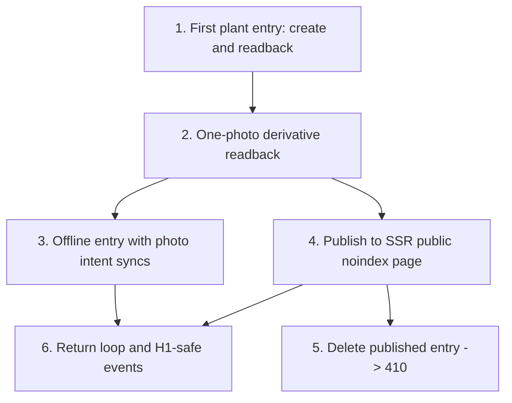

# SDD Vertical Slice Roadmap

Status: living execution roadmap
Date: 2026-06-26
Last operational update: 2026-08-20 (OVE-320 online-only canon; authenticated Linear remains primary queue authority)
Owner: founder
Repo source of truth: `AGENTS.md`, `docs/LINEAR_AI_EXECUTION_TASK_STANDARD.md`, `docs/TECH_STACK_DECISIONS.md`, `docs/adr/ADR-0014-agentic-stack-realignment.md` as superseded for connectivity by `docs/adr/ADR-0017-online-only-product.md`, `docs/WALKING_SKELETON.md`, `docs/SCAFFOLD_STATUS.md`, `docs/INFRASTRUCTURE_REGISTRY.md`, `docs/product-research/README.md`

This is not the full product backlog. It is the living execution roadmap for the next product-learning slices after the walking skeleton. The skeleton proved the stack; it is not product UI and it is not the final product data model.

ADR-0017 is the current online-only authority. New work must use
network-required, server-authoritative saves and must not extend the historical
PWA, Dexie, IndexedDB, local-draft, queued/synced, or offline-capture behavior
recorded later in this file. Those matches are implementation provenance or
named `runtime_pending_child` residue until OVE-321 through OVE-326 close.

From this point forward, product implementation work must be shipped as narrow vertical SDD slices that wire one user behavior end to end: SQL/types -> scoped repository -> route/action/API -> UI -> background job/search/media if relevant -> tests -> docs. A task that only creates schema, only builds UI, only wires media, or only adds instrumentation is not a valid product execution slice unless it is embedded inside a user-visible path and proves integration through that path. Remediation, operator, decision, canon-correction, and coordination-container work uses the bounded issue-kind contracts in `docs/LINEAR_AI_EXECUTION_TASK_STANDARD.md`; never invent fake product layers for those exceptions.

## Current Execution State

Authenticated current Linear read-back is the primary queue authority; this
section is its dated repository mirror. If issue status, blocker order, project,
or milestone differs, do not pick a winner silently: stop task selection,
reconcile the canon, update this mirror when appropriate, and then read Linear
back again. The authenticated connector read-back on 2026-07-26 found all 32
issues OVE-213 through OVE-244 in `Todo` under
[SDD Slice 19 - MVP Readiness Remediation And Launch Proof](https://linear.app/overgarden/project/sdd-slice-19-mvp-readiness-remediation-and-launch-proof-724bdf2ae236);
the newest issue update in that set was `2026-07-25T22:18:33.986Z`. Identifier
order alone is not execution order.

Current Stable Registry authority: ADR-0016 and
`docs/STABLE_REGISTRY.md`. OVE-253 remains a historical `blocked_manifest`
receipt proving that no official EPPO release/checksum manifest was available;
it is not the current future-work gate. OVE-254 may create an immutable,
separately labelled OverGarden observed capture after OVE-318 terminal
closeout. OVE-255 and later children independently own rights/identity/release,
product readback, editions, and production parity. No capture count or raw
source row can imply product completeness or flow directly to product/search.

OVE-314 is the mandatory control-plane reconciliation gate inserted before
resuming OVE-294. It removes `/admin`, `/admin/users`, pilot status/smoke/manual
learning pages, `/join`, and product-access invite/grant/hint ownership; moves
the four surviving sealed-owner destinations into the ordinary avatar menu;
preserves self-serve email/password and Google plus lineage invitations; and
converges learning to one real `real_self_serve` cohort. Historical roadmap
mentions of closed-pilot/founder-rehearsal access are provenance only.

On 2026-08-10, OVE-285 was individually re-audited against repository baseline
`5c403444cddc2e195690808de08304d14fe41fd3`, the terminal OVE-296 receipt, and
the authenticated Linear DAG. Its report-only v3 registry closes 592 production
source files into 2,439 resolved source nodes, 295 logical entrypoints, 183 true
effect boundaries, and 655 consumer edges with zero unresolved entries. The
registry, source-evidence, and receipt digests are respectively
`c917ed87bfb7b84f54435ff99e5cf768a3c41427cb8e7f5b58e6978387181406`,
`b627003b927dc53e84bdd58870f5df6faee627e6843e55795cdfd47874bb4817`, and
`c725f3b6dd0fe18c3dbae09c56a714573f56e1d6fff32d83f4549c9cf14ebdd7`.
The binding decision is
`docs/architecture/AUTHENTICATED_MUTATION_ADMISSION.md`; no runtime behavior,
provider state, production data, or deployment configuration is changed. The
authenticated strict chain is OVE-296 -> OVE-285 -> OVE-293 -> OVE-288 ->
OVE-290 -> OVE-286 -> OVE-287 -> OVE-291 -> OVE-289 -> OVE-294 -> OVE-295 ->
OVE-298 -> OVE-292 -> OVE-284 -> OVE-186. OVE-297 remains a separate DAG leaf,
not a member of that strict chain. Terminal issue status and relations still
require authenticated Linear read-back before selecting OVE-293.

On 2026-08-12, OVE-295 reached authenticated terminal closeout: feature commit
`7c2e45f86e81b9bd1df61fce68a56ca49fc77b31` is contained in current-main merge
`9449455db4e4417f03ad08e7bdd4c212eb4f1f00`; deployment
`dpl_HMLdqNQE6U2nxSnpQ31DvRtESYKq` is READY and promoted; explicit linking is
still absent/false; and migration `0022` remains production-unapplied by
design. OVE-298 now owns the approval-bound aggregate preflight, the exact
`0022` index apply, flag enablement, an ordinary non-owner/non-admin disposable
link/read-back/unlink/revocation/cleanup journey, and terminal production
receipt. Its enablement fence must keep the OVE-314 sealed owner credential-only
in both account-method projection and direct pre-provider-state admission.

OVE-298 reached authenticated terminal closeout on 2026-08-12 after two earlier
attempts failed closed and were independently cleaned. The approved second retry
completed one ordinary credential-account link, authoritative credential-plus-
Google read-back with unchanged identity/content digests, fresh credential
session, unlink, provider revocation, and canonical erasure. Final production
inventory is `1/0/0/0/0`; both partial unique indexes are exact;
`GOOGLE_ACCOUNT_LINKING_ENABLED` is present/effective; and the sealed owner
remains verified credential-only with exactly four avatar-menu operator links.
Deployment `dpl_EcPeDH6WY9pLJTDriu2Bi4Y7DtT6` is READY for current main
`a167afe5caacdadd9fa95d5c8ba3db4d396d358e`. Receipt
`overgarden.google-linking-production-receipt.v1` passed with digest
`eaa3c51b565aee03066da6d743215deb36d09d5862ca80d54e7465ef5bfa8262`;
all disposable identity/provider/session/inbox/browser/local artifacts are
absent. OVE-292 is now the active successor and owns only the exact-SHA
integration harness and redacted composition receipt. Its source manifest
digest is `0077a025a9facbaee60e4f78f21c77cb49ffeee9c2db30dfff9e6c088c896bc0`;
production mode is GET-only, creates no authenticated session, and consumes
child receipts for all mutation/provider/identity claims.

On 2026-08-10, OVE-293 was selected only after authenticated OVE-285 terminal
read-back and was individually re-audited against clean repository baseline
`05af6cd53c1c43f5d3754577a590f791f99ae869`. Its v6 device-local durability
protocol binds every mounted production composer write to an exact
owner/draft/participant/generation transaction and independent read-back;
ordinary unproved writes invalidate stale evidence. `OwnerWorkInspectionV2`
now reports either an exhaustive, payload-free exact-owner inventory or one
explicit unavailable reason with no counts or destructive authority. Abort,
participant/generation drift, schema failure, Blob failure, hard-bound contact,
and the 5,000-millisecond deadline all fail closed. Sign-out launches inspection
as invisible background evidence, never awaits it, never offers a purge or
sync-first choice, and always retains work. The required OVE-285 downstream
registry regeneration closes 593 production files into 2,476 source nodes and
303 entrypoints with zero source-policy, registry, semantic, or unresolved
findings; its registry/source/receipt digests are respectively
`c49e5e22e4c1f1cba678fbae18e829bbdc0c793a4af746d4c0aba1de67a2da92`,
`3f5620a5d7fb7a31836ce53a253054b81fbfa0d45e62e351c6cb8cf863a43f4a`, and
`868e076ae689950edd9b0d3dbe5191ec61ffcd4d07abcd7e0399806ad65ffd34`.
Exact implementation containment, READY deployment identity, terminal
relations, and saved-description digest remain authenticated closeout/read-back
requirements before selecting OVE-288.

On 2026-08-10, OVE-288 was selected only after terminal OVE-293 authenticated
read-back and a clean `e6f59c87e7c4fa6cc4136665223e75e292c79049` baseline.
Its `ove288.owner-vault-binding.v1` same-session server receipt activates one
opaque physical Dexie vault per owner only after bounded exact-owner legacy
copy, target close/reopen fingerprint read-back, and exclusive writer
convergence. Ordinary sign-out retains both verified and uncertain work;
binding or IndexedDB failure degrades only offline capability. The separate
localized current-device erasure control reports success only after the exact
target and exact-owner legacy residue are independently absent. The downstream
OVE-285 registry regeneration closes 600 production files into 2,550 source
nodes, 325 entrypoints, 184 true effect boundaries, and 660 consumer edges with
zero source-policy, registry, semantic, or unresolved findings; its
registry/source/receipt digests are respectively
`94e9c7d449f3ab9446882f9efd970b5b138330906c102bacbfbed463f61f7f36`,
`86d5eb35f38a2f2ae4e261c3a72580657c8bf7b98ea3476969c4b829f5d5ff91`, and
`fe551283ceefd2cee5fd9b8b63a3fabd9d9357aa26b5ebac39565f8b94919c4e`.
OVE-290 may be selected only after OVE-288 exact-main containment, READY
deployment identity, terminal relations, and saved-description digest are read
back through the authenticated closeout.

On 2026-08-10, OVE-290 was selected only after those OVE-288 gates passed on
clean baseline `b48d98918a5f6c8edacf479963750050cc626ec2`. Its signed
`DocumentMutationGenerationV1` performs one no-cache Better Auth snapshot and
fences garden create/edit/publish, offline replay, media upload/process, and
focal mutation before the first canonical/provider effect. Owner changes,
same-owner new sessions, invalid/old protocol, signed-out state, and resolver
failure retain distinct closed results; only one already-durable idempotent
offline row may retry after a fresh same-owner generation. The R2 header is
structurally omitted from direct PUTs and effective presign TTL is positive and
at most both 900 seconds and remaining envelope life. The final OVE-285 graph
contains 607 production sources, 2,563 source nodes, 316 entrypoints, 184 true
effect boundaries, 660 consumer edges, and zero unresolved findings; its
registry/source/receipt digests are respectively
`77f0959509cdba4bfda547d2196309386ca81af3ed05bb93df863b481aaf604a`,
`5fff648efe50ebe2187e0ab1ff5942e445155f62e1803e26319b791566f822e6`, and
`cabe55f210ddc164c527b7f28c7e6ca406217e5cd639cb6df0c541587b24c5db`.
The separate enforcement receipt marks all baseline 36 high-risk entrypoints
and 281 associated consumer edges enforced at the same 24 admission
boundaries. Exact-main containment, READY exact-SHA deployment, reject-only
production zero-effect proof, and authenticated Linear read-back remain the
closeout gates before OVE-286 starts.

On 2026-08-10, OVE-286 was selected only after those OVE-290 gates passed on
clean baseline `63878e7591ff22f0b32c7585e5f212d16411a484`. Its route policy
admits only `/garden/entries/{valid UUID}/edit` to non-fencing ordinary session
rechecks; every other authenticated route retains the OVE-236 compatibility
fence until OVE-291. One payload-free persistent invalidation marker closes
sleeping/BFCache documents, terminal evidence never reopens the old document,
and a same-owner new session reloads without a false owner-change transition
before fresh authoritative owner-activity rebind. The topology-only registry
regeneration contains 608 production sources, 2,568 source nodes, 316
entrypoints, 184 true effect boundaries, 660 consumer edges, and zero
unresolved findings; registry/source/receipt digests are respectively
`30edfe26aef3191d1339b791e0ebc0192b1898df79e4569a0fa7878a6b37bea0`,
`faaf957a24ccf600b8dd567fa731b99776985861862959657a9768f06a19a50b`, and
`5b9840061318b2de10e00207f8a51ca104988533ac09324b5ff5700e7ccf032b`;
the rebound enforcement receipt preserves all baseline 36 high-risk
entrypoints, 281 consumer edges, and 24 admission boundaries. Exact-head CI,
current-main containment, READY exact-SHA deployment, immutable smoke, and
authenticated Linear read-back remain the closeout gates before OVE-287.

On 2026-08-11, OVE-291 was selected only after OVE-287 reached authenticated
`Done` and its implementation was contained in clean baseline
`964a4a7e7c86fa95b0e15e98852b008f42613f09`. The shared OVE-290 classifier now
guards all 124 remaining authenticated mutation entrypoints and 347 consumer
edges at 65 declared pre-effect boundaries, including exact Better Auth
account/session POSTs while preserving ordinary Google authentication and the
five-entrypoint, 15-edge explicit-link partition for OVE-295. Shared native
form and fetch recovery retains intent without automatic replay. The final
source graph contains 615 production sources, 2,618 source nodes, 314
entrypoints, 181 true effect boundaries, 656 consumer edges, one retired
provider denial, and zero unresolved findings; registry/source/receipt digests
are respectively
`633f9071fd4f2ef30f4036e5faed5b295590a90b82f3a518a3080bcba67bcdda`,
`00a143bb0639d55836f71cb374a79dc22ae06fbb8a9f6b4f2c98d878cb9f4187`, and
`664fe875da2c9c9ff986aac430962a572823bb7377ea013f217767ec92185b7a`.
The runtime read-back imports only the bounded deployment receipt
`fe61f044ca6623a774709a2e55475a774cf8aed43db1f4c125e3b05e243fe340`;
the full registry and enforcement artifacts remain excluded from production
chunks.
Exact-head CI, current-main containment, READY exact-SHA deployment,
reject-only native-UI/provider proof, and authenticated Linear read-back remain
the closeout gates before OVE-289.

On 2026-08-11, OVE-289 was selected only after terminal OVE-291 containment in
clean baseline `b53157a559c3a1087e8c53c142028ba0d9bcd5c2`. The authenticated
garden now owns exactly six foreground triggers through one current
owner/document coordinator. Empty queues stop before admission and network;
non-empty queues consume the shared OVE-290 3,000-millisecond check and an
atomic per-revision marker before one bounded sequential drain. Failure,
`Retry-After`, crash recovery, cancellation, and late completion are
manual-only; only an explicit manual action or genuinely new queue revision
reopens work. The service worker retains zero Background Sync mutation paths,
and success conditionally clears only the draft that still carries the synced
client mutation ID. The local/preview-only browser proof covers all six
triggers, owner/document races, three locales, and responsive garden, editor,
locale, manual-sync, and sign-out controls at the exact admission deadline.
The regenerated graph contains 619 production sources, 2,649 source nodes, 328
entrypoints, 184 effect boundaries, 671 consumer edges, and zero unresolved
findings; registry/source/receipt digests are respectively
`e8a87b3291a3cb9948658f722b779fdc1d2c13fe2411aa74c73d7ac51387e5d9`,
`acc5405c23f5229e48f52bdc36947f8d2c4990d351ad9464b71914fc1d159437`, and
`e720b1c54a84ade23ea63929a11def99c98d0fd47265cc2c20f8f7c47f1f1ce9`.
The enforcement expansion preserves all OVE-291 and OVE-295 sets while binding
42 high-risk entrypoints, 296 edges, and 30 live boundaries. Exact-head CI,
current-main containment, READY exact-SHA deployment, runtime isolation, and
authenticated Linear read-back remain the closeout gates before OVE-294.

On 2026-07-28, OVE-242 was re-audited and materially rewritten against current
`main` (`dd3b7a6906d5dbf215627d7b6a1de6348befcd16`), passed final validation,
was saved and read back, moved to `In Progress`, and closed on `main` through
merge commit `e497ebf9c4daf2892e20a068596d1de868aec837`. The remaining 31
issues in the range stay in `Todo` and are still unrewritten.

On 2026-07-30, OVE-238 was individually re-audited, materially rewritten,
validated, saved, and read back before implementation. Its behavior commit
`d2fcb8d99058b8b0eeb87c6e86b7b7bef347c23f` is contained in `main` through
`cd70b3e632650f7b0e74ea929c032e2944bc8e6c`; exact-main CI
`30495816073` and Vercel production deployment
`dpl_84mFTk4rMcsbs2YCa83GAvv2zqDd` passed. The terminal Linear state and
relations are deliberately not duplicated here: they must be obtained by the
authenticated read-back before selecting OVE-235 or OVE-222.

On 2026-07-30, OVE-214 was individually re-audited, materially rewritten,
validated, saved, and read back before implementation. Its behavior commit
`b0b111767` and the deterministic privacy and production-smoke follow-ups
`369d0383a05d9228956964e8a075a6975aad0139` and
`63a4e7df54e2162466dee7cfb3cf525c1408628b` are contained in `main`.
Exact-main CI `30530522406`, matching-image run `30530522469`, Vercel production
deployment `dpl_7pzKYUwgDZsponohTZmQJN2pU93E`, the canonical public smoke, and a
Safari Technology Preview keyboard handoff trace passed. OVE-236 may be
selected only after OVE-214's terminal Linear state and blocker relation are
read back through the authenticated connector.

On 2026-07-30, OVE-236 was individually re-audited, materially rewritten,
validated, saved, and read back before implementation. Its reviewed behavior
commit `e5ff0b36c4589073c151df5092168a39efaf70df` is retained as a true `main`
ancestor through containment receipt `c3926f0a6abbed1e144a4004605919138be9fb55`
and merge `2294a3eeb7dbcdbe204a9960bc9bcc92f6b1d694`; the behavior-equivalent
main integration commit `ccb40b279837dd42d747203505aadbd97608248d` passed CI
`30540705280` and Vercel production deployment `dpl_9Vc7V6zKN4xxSt9jZFUzRoJhp3xa`
reached `READY` for that exact SHA with both canonical aliases. The bounded
synthetic race harness passed in Chromium and Safari Technology Preview, proving
private-tree removal precedes identity-read resolution and reopening requires
the exact same binding. The terminal Linear status and relations remain an
authenticated read-back requirement before selecting OVE-186.

On 2026-07-30, OVE-235 was individually re-audited, materially rewritten,
validated, saved, and read back before implementation. Its behavior commits
`b285b3fb882a72180af4ee38fa62ed3bcf904be5` and
`e6969117a5e1932369b52b64aaaa66881523ae24` are contained in `main` through
`f470448c70de8135c9fb357f47ef9ce70ebe1492`; exact-main CI `30506384943`,
matching-image run `30506384967`, and Vercel production deployment
`dpl_FzWQKdbxjo8JgP7uXbqKMFCbWWKJ` passed. The terminal Linear state and
relations are deliberately not duplicated here: they must be obtained by the
authenticated read-back before selecting OVE-237, OVE-184, or OVE-222.

On 2026-07-30, OVE-222 established one typed locale-aware journal-evidence URL
owner for every selected-locale public and social projection. Ukrainian journal
evidence remains unprefixed, while Bulgarian and Russian evidence is rendered
directly under `/bg/journal/...` and `/ru/journal/...`; the locale-neutral base
path remains the canonical owner for metadata and search documents. The scope
does not change Ukraine's uk-only market fence, Bulgarian bg/ru policy,
same-path catalog or passport URLs, public eligibility, lifecycle, indexing, or
the OVE-238 return-path firewall. Its terminal Linear status and production
receipt must be read through the authenticated connector before selecting the
next dependent work.

On 2026-07-30, OVE-184 was individually re-audited against current main after
its completed blockers were read back. The revalidation confirms the existing
guest-readable, readiness-gated `observation-and-care` community behavior and
its later OVE-217, OVE-239, and OVE-235 hardening: canonical public journal
references, actor-scoped participation and moderation, localized fail-closed
lifecycle, noindex policy, bounded public-search degradation, and
production-refusing visual fixtures remain owned by their established modules.
The closeout record adds no community capability, data mutation, or policy
owner; terminal Linear status, exact-head CI, and production evidence remain
required before a dependent item is selected.

All 32 OVE-213 through OVE-244 descriptions predate the v1 contract. Their
content informed the standard, but no issue in the range is ready for assignment
or `In Progress` by provenance alone. Before execution, re-audit and materially
rewrite the selected issue against current `main`, authenticated Linear
fields/relations, and current external state; run draft plus final validation;
save and fully read back the issue; and match the saved-description digest. Do
not bulk-certify or bulk-transition the batch. This governance slice creates the
gate only and does not perform any of the 32 remediation implementations.

### Dated implementation history — not queue authority

The narrative below preserves decisions and proof snapshots at their stated
dates. Its words `current`, `next`, `must`, and `remaining` are historical unless
the authenticated Linear read-back above and current mainline canon explicitly
reconfirm them. It must never override the primary queue authority.

On 2026-07-23 the founder adopted the two-kind object category model in
`docs/OBJECT_CATEGORY_MODEL_2026-07-23.md`: exactly `{plant, animal}`, with a
hive modeled as an `animal` that carries a bee-breed catalog identity
(vertical-agnostic; `bee_colony` hard-removed). Implementation collapse is
[OVE-211](https://linear.app/overgarden/issue/OVE-211/collapse-object-kinds-to-plant-animal-remove-bee-colony-a-hive-is-an).
Until OVE-211 ships, the [OVE-186](https://linear.app/overgarden/issue/OVE-186/drive2-parity-production-closeout-prove-the-complete-guest-to-journal)
gate wording `plant/animal/bee coverage` remains historical for the current
three-kind schema and becomes `plant/animal coverage` once the collapse lands.

The post-audit MVP closeout queue is tracked in Linear after Slice 18. OVE-189 closes its canonical local-media prerequisite: a maintainer/agent can classify a corrupt Apple Container MinIO volume, plan without mutation, salvage the fully readable user-bucket tree from an exact read-only source into an explicit new target, preserve the source, and prove actual media plus Postgres/Meilisearch/MinIO persistence across full container recreation. The binding runbook is `docs/LOCAL_MEDIA_RUNTIME_RECOVERY.md`. OVE-190 then proves immutable exact-source parity between production matching API and worker, the complete six-handler canary, bounded capacity controls, rollback/forward activation, and restart recovery. OVE-191 removes shared scaffold identities from source and production assets, makes the old walking-skeleton page/API explicitly loopback-only with defense-in-depth refusal, and gives its local API stable opaque `401`/`403`/`400`/`500` semantics. OVE-203 removes user-entered signup names and makes one pseudonymous public identity a provider-independent database invariant: every Better Auth user receives one generated handle/profile/current registry claim, can make an immediately available moderated custom rename followed by a persisted 30-day cooldown, and leaves retired handles permanently reserved behind generic `410`/`noindex` routes. Confirmed person references resolve through stable user identity, public/social/search projections fail closed for private, removed, inconsistent, or mutually blocked identities, and the aggregate-only migration/restore proof is bound by `docs/PUBLIC_IDENTITY_MIGRATION_RUNBOOK.md`. OVE-204 adds one provider-neutral current-session exit coordinator across My Account, desktop/mobile shell, and real excluded operator surfaces. It binds browser-local writes to an opaque authoritative session generation, pauses owner-local writes before inventory, gives an exact three-outcome unsynced-work decision, purges only the confirmed owner's unsynced Dexie rows and nested Blobs, installs a durable pre-POST commit fence, confirms the authoritative Better Auth session is absent before hard locale-aware navigation, and converges other tabs/BFCache through exact preparation rounds without putting identity in the signal. Unknown post-request state remains fenced. Other device sessions, profile, provider links, role, garden data, consent, service worker, and non-owner local rows remain unchanged. OVE-202, OVE-206, and OVE-207 must extend this coordinator for structured documents, block order, ten inline photos, and a separate cover rather than fork sign-out behavior. Downstream issues must use these canonical runtime, auth, identity, and session-lifecycle boundaries and may not reinterpret a health endpoint or hidden development convention as proof.

OVE-205 shipped the corrective localization baseline on behavior commit
`b6145c1a3c176df5ef8634961b5d5642d5b87cbf`. It preserves the typed
`uk`/`bg`/`ru` copy contracts but resolves market before locale: Ukraine is
unprefixed and `uk`-only with no language control; Bulgaria defaults to `bg`,
allows `bg|ru`, uses explicit `/bg` and `/ru` public routes, and renders exactly
one shared control on every user-facing page/state. Public switching rebuilds
only allowlisted query/fragment state. Canonical unprefixed product/auth/garden/
operator routes use a narrow same-origin POST preference boundary and the same
dirty/in-flight document-transition coordinator. The fail-closed schema-v3 gate
covers pages/route handlers, layouts, loading/error/not-found/global-error
boundaries, raw application-owned lifecycle HTML, owner/denied variants, and
zero/exactly-one control proof. Exact-SHA CI, deployment, production smoke,
protective-DNS, A1 browser, Ukraine route, and real `410` evidence passed.

OVE-208 binds all existing `uk`, `bg`, and `ru` proportional/heading text to one
Google Sans semantic token, including route states, raw lifecycle `404`/`410`
HTML, and global error. Geist Mono remains semantic-only. Pinned,
content-hashed font assets are same-origin and immutable, stay outside
personalized proxy handling under `/fonts/`, and make no runtime Google Fonts
request. Locale-prefixed object-passport lifecycle paths
(`/bg|/ru/lineage/objects/...`) share the same strip-locale matcher used by
community, journal, and profile raw documents. A focused Chromium/Firefox/WebKit
gate checks computed family, loading, requests, actual Google Sans rendering,
authoritative `html[lang=bg]`, glyph coverage, and real italic; the offline
OpenType shaping verifier separately proves the Bulgarian `cyrl/BGR locl`
substitution. These checks complement and do not replace the full
171-scenario/642-route-viewport Chromium matrix. The change is a reversible,
unvalidated product hypothesis and preserves the existing information
architecture, color, copy, action semantics, and visual language. Its only
component layout delta is a mobile community-report containment fix required by
the 320 px localized reflow gate. After OVE-208 closeout, OVE-202 shipped the
structured journal composer (`JournalDocumentV1`, shared owner composers,
multi-photo offline sync, edit/conflict, SSR renderer). OVE-206 is the next
execution owner for accessible block reorder.

OVE-205 is now the stable dependency for work that needs this locale lifecycle;
it is not permission to claim future UI. The founder-approved 2026-07-22
clarification preserves the dependency order OVE-205 -> OVE-202 -> OVE-206 ->
OVE-207. OVE-205 proved the extensible coordinator, all existing states, and a
payload-free owner-composer adapter. OVE-202 must consume the shared
proportional token, persist no `font-family` in structured content, use a real
italic face, and replace only its Cyrillic IME, serialization, inline-photo,
conflict, offline, upload, and failed-flush ownership entries with real browser
proof; OVE-206 must then replace only
its pointer/touch/keyboard reorder, gesture fence, committed order, focus, and
announcement entries; OVE-207 must close automatic/explicit/separate cover,
cover upload/recovery/removal, and combined ten-inline-plus-one-cover entries.
Those schema-v3 rows for OVE-206/207 remain fail-closed downstream obligations with
`status: downstream-owned-real-ui`, `browserScenarioId: null`,
`proofOwner: owning-downstream-slice`, and `blocksCurrentIssue: false`. OVE-202
now records `browser-backed` with scenario `editor-clean-locale-transition`.
They cannot be reported as implemented before their owning slice ships.

The historical UI/UX/IA reconstruction queue was Linear project `SDD Slice 18 - Drive2-Parity Product Reconstruction` (`OVE-172` through `OVE-186`). It directly rebuilt production routes; there was no separate clickable-prototype phase. `OVE-172` provides the shared guest/authenticated shell, typed route configuration, minimum session variant, responsive navigation, explicit loading/error/404/410 states, and matched Drive2/OverGarden visual evidence gate. `OVE-173` provides the guest-open root feed through a privacy-minimized public repository, explicit kind/trusted-topic filters, stable cursor pagination, mixed-media journal cards, authenticated-only followed access, route-owned context modules, localized edge states, centralized UGC-feed noindex/sitemap exclusion, and matched desktop/mobile visual proof. `OVE-174` provides the shared mutation-time auth boundary: all eight guest mutation classes use one allowlisted encrypted intent, public reads remain session-free, email and social sign-in share the exact resume callback, cancel/expiry/tampering fail safely, canonical mutations independently reauthorize, and the resumed route focuses the interrupted control without carrying draft or private payloads. `OVE-175` provides the guest-open living-object catalog with real grouped taxonomy, URL-owned kind/identity/search filters, canonical pagination, public-safe object evidence, localized states, and deterministic visual thresholds. `OVE-176` provides the guest-open journal directory with canonical Postgres filtering, optional UUID-only Meilisearch relevance hints, kind/catalog/topic/season/coarse-region filters, stable URL state through journal detail and back, bounded derivative media, and deterministic ordered-query evidence. `OVE-177` provides the guest-open localized knowledge hub, authored guides/answers, curated topics, explicit editorial-versus-UGC trust states, explainable topic/catalog evidence, and public journal/object continuation without an authentication prompt. `OVE-178` provides one shared living-object passport presentation contract backed by separate public-safe and owner-scoped loaders, kind-specific identity/context facts, bounded derivative media, chronological journal disclosure, previous/next navigation, mutation-time authentication, owner controls, and hard public `404/410` lifecycle handling. `OVE-179` rebuilds public journal entry readback around lifecycle-safe object/space context, media, chronology, and mutation-time engagement. `OVE-180` rebuilds public and owner gardener profiles around living-object and journal evidence with scoped relationship controls. `OVE-181` replaces the former settings-like garden page with an owner-scoped operational workspace: one next action, mixed inventory, spaces, recent continuity, browser-local drafts, sync/media recovery, and bounded disclosures inside the shared shell; guest entry remains reversible and read-open until a write intent. `OVE-182` rebuilds first-object and next-update creation as low-friction plant/animal/bee flows with existing-space reuse, progressive optional detail, private-first publication, durable owner-scoped drafts/offline retries, bounded derivative media, and canonical idempotency under concurrent retries.

`OVE-183` completes the in-product return loop with guest-readable chronological comments/replies, exact mutation-time auth resume, profile/object/topic follows, a public-only chronological followed feed, private bookmarks/wishlist, code-owned notification summaries with explicit category preferences, and report/block controls whose two-way block predicate removes actors from every affected read model.

`OVE-184` adds the first moderated thematic community without opening user-created groups. Guests can read `/communities` and the `observation-and-care` overview, rules, aggregate membership/object counts, and canonical public-journal stream; authentication appears only for joining, contributing, reporting, or blocking and returns to the exact preserved control and filtered page. Signed-in members explicitly join/leave and contribute an existing eligible public journal by reference rather than copying its content. Archived communities preserve safe canonical evidence and allow an existing member to leave without accepting a join or contribution. Moderator-only actions reauthorize against an active assignment, remove or restore only the community projection, close discussions or participation, ban members, resolve reports, and append bounded audit events. Unknown or draft lifecycle lookup returns a hard localized `404`, all community/profile surfaces remain `noindex`, two-way blocks plus active-profile, ownership, and canonical publication predicates suppress unsafe rows, and navigation appears only after active rules, moderator, curated topic, open participation, and a real public contribution satisfy readiness.

`OVE-185` hardens the complete OVE-173 through OVE-184 journey for mobile, keyboard, screen reader, large-text, reduced-motion, and desktop use without creating alternate mobile data or authorization paths. Its matrix is derived from the unchanged OVE-187 v8 manifest and binds 171 stable scenarios across thirteen archetypes to 320px and 1440px, with dense and high-risk states additionally exercised at 360px, 390px, 640px 200%-reflow equivalence, 768px, 1024px, and 1280px for 642 route/viewport checks. The gate fails on horizontal overflow, offscreen controls, missing landmarks/headings, duplicate IDs, browser errors, critical/serious Axe findings, broken keyboard focus containment/return, inaccessible auth intent, lost report/block controls, reduced-motion regressions, or 200% text scaling that removes creation controls. Shared shell, shadcn Button, composer, workspace, passport, profile, community, feed, catalog, journal, knowledge, and social corrections preserve route parity and privacy controls; the browser harness refuses Production and uses only redacted manifest evidence.

`OVE-186` is the final integration and production-proof gate for Slice 18. `pnpm drive2:closeout:check` binds the unchanged OVE-187 v8 hash to all 171 scenarios, 642 route/viewport checks, thirteen archetypes, required state classes, plant/animal/bee coverage, every auth-intent action, and explicit guest/authenticated journey scenarios; CI fails on any missing dimension. `pnpm drive2:closeout:report` emits the redacted machine-readable route/state matrix with current commit and environment class. `pnpm smoke:drive2-production` separately proves canonical guest reads, public passport/journal/profile continuation, representative mutation-time authentication, Production fixture refusal, sitemap/public-HTML isolation, no-store privacy, locale foundations, and exact tested/deployed SHA equality. The binding runbook is `docs/DRIVE2_PARITY_PRODUCTION_CLOSEOUT.md`; deterministic fixtures never substitute for real production smoke. OVE-188 satisfied its default-A1, Cisco resolver, browser, and bounded-security gates on 2026-07-22 and no longer blocks OVE-186. OVE-186 must still rerun protective DNS and every exact-SHA release gate against its own final `main` baseline; any renewed sinkhole reopens the blocker.

`OVE-187` remains the production-refusing visual-data prerequisite for the reconstruction: its v8 manifest deterministically seeds real repositories and routes with 8 profiles, 10 spaces, 30 mixed living objects, 81 journals, 16 generated raster derivatives, 7 curated topics, 40 accepted public signals, 24 comments/replies, 16 bookmarks, 8 direct follows, 2 comment reports, 2 notification receipts, 2 preference rows, 14 wishlist items, 4 communities, 9 rules, 14 memberships, 4 moderators, 24 canonical community contributions, 1 community report, and 1 audit event. Its evidence owns 11 journal-directory URL/count/ordered-ID cases, 10 knowledge entry/object cases, 14 public/owner passport cases, 17 journal-entry cases, 10 profile cases, 8 owner-workspace cases, 15 social return-loop cases, 18 community cases, 20 resettable OVE-182 creation cases, and 21 credential-free OVE-174 intent scenarios. The verifier uses canonical SQL/loaders, repairs bounded fixture mutation artifacts, preserves unrelated local records, and requires loopback database and object-store/public-media endpoints. Continue from the current Linear blocker order; every remaining production behavior must use this fixture environment for desktop/mobile evidence instead of approving empty or one-record screens. The operator contract is `docs/VISUAL_FIXTURE_ENVIRONMENT.md`.

The earlier project `SDD Slice 15 - Drive2 Pattern Audit And Living-Journal Redesign` is superseded. `OVE-145` through `OVE-147` remain the completed research/synthesis record, and `OVE-148` through `OVE-150` remain historical completed implementations, but none of those completed cards is current visual approval. `OVE-151` through `OVE-156` are canceled with direct replacement relations to Slice 18.

Localization foundations `OVE-164` and `OVE-165`, incremental consumer slices `OVE-166` through `OVE-170`, and the OVE-171 copy/route baseline are complete regression inputs and must not regress. `docs/LOCALIZATION_COVERAGE_BASELINE_2026-07-14.md` records those exact-parity contracts and the localized work shipped by OVE-172 through OVE-185; `docs/LOCALIZATION_COVERAGE_WORKFLOW.md` defines the shipped OVE-205 gate and binding extension procedure. The historical `ove171-v1` gate classified 92 page/route modules, validated 22 existing copy namespaces across `uk`/`bg`/`ru`, and added 13 owner/edge probes to the shared OVE-187/OVE-185 matrix. OVE-205 treated those numbers as a preserved baseline rather than completion and proved every discovered layout and rendered state/lifecycle owner, the market-specific zero/exactly-one control invariant, switch security, dirty/in-flight behavior, and exact-SHA CI, deployment, production smoke, and protective-DNS evidence on `b6145c1a3c176df5ef8634961b5d5642d5b87cbf`.

The deterministic catalog-matching queue `OVE-158` through `OVE-163` now includes the completed OVE-158 advisory worker/read-model contract and OVE-159 explicit canonical-match decision contract in `docs/CATALOG_MATCH_SUGGESTION_QUEUE.md`, the completed OVE-160 review-gated synonym/locale-variant contract in `docs/CATALOG_ALIAS_SUGGESTION_REVIEW.md`, the completed OVE-161 gardener typeahead/save/readback contract in `docs/CATALOG_GARDENER_TYPEAHEAD_READBACK.md`, the OVE-162 fuzzy entity-resolution extension in `docs/CATALOG_ENTITY_RESOLUTION_QA.md`, and the combined OVE-163 rollout gate in `docs/DETERMINISTIC_MATCHING_ROLLOUT_PROOF.md`. Provisional saves enqueue privacy-safe off-request matching; evidence alone cannot mutate canonical state. A curator can approve one current canonical suggestion through an atomic merge/object-update/audit/reindex transaction while journal rows remain unchanged, or reject only that suggestion with a bounded reason and no product-state mutation. Separately, deterministic Ukrainian, Bulgarian, and Russian alias variants remain detached from `catalog_item_names` and typeahead until a curator approves current fingerprint-bound evidence; cross-concept collisions fail closed, and rejected or accepted rows survive unchanged replay. Gardeners can discover accepted names through real Meilisearch one-typo evidence or canonical Postgres fallback, explicitly select one UUID in both first-entry and existing-object flows, and retain Unknown/own-name escape paths without leaking search internals or duplicating provisional identities. Source-backed QA persists bounded RapidFuzz near-duplicate pairs beside the existing exact/alias/source-conflict groups; same-locale evidence recommends manual merge review, while cross-locale or stale evidence is held, and no fuzzy path mutates canonical/search state. OVE-163 now composes those behaviors into one loopback proof, verifies recovery/idempotency for every matching refresh kind, recursively rejects unsafe evidence, and adds a strictly read-only production readiness mode. OVE-167 and OVE-168 build on the final OVE-161 picker/readback contract; OVE-170 localizes the final OVE-163 operator surface rather than freezing interim English copy.

Execution Batch 1, the original Slice 1-7 roadmap text below, and the former OVE-114 through OVE-139 MVP follow-up batch are historical implementation guidance, not an active queue declaration. `OVE-114` is the docs reconciliation anchor; `OVE-115` through `OVE-139` are the vertical follow-up slices that converted the 2026-07-03 founder/operator MVP decision into product behavior. Select current work only from authenticated Linear read-back under the authority rule above.

Before selecting or starting any next Linear issue, run:

```bash
cd apps/web
pnpm mainline:closeout:check
```

Then read `docs/MAINLINE_CLOSEOUT.md`. As of OVE-50, the critical OVE-29 and OVE-30 fixes that were branch-only during the 2026-06-29 audit are proven on current `main` by `docs/mainline-closeout-ledger.json`. Historical OVE-53 field evidence remains in Linear as a dated discovery receipt; OVE-314 supersedes its invite/cohort operating model. Do not add participant identities, credentials, private journal text, media keys, private screenshots, IP/user-agent, or precise location to repo docs.

The 2026-07-01 OVE-96 lineage/social graph post-MVP decision is superseded by the 2026-07-03 founder/operator decision recorded in `docs/MVP_SCOPE_RECHECK_2026-07-03.md`. Lineage/social graph is now MVP scope and must be planned as vertical SDD slices with the privacy/consent invariants from `docs/product-research/CROSS_USER_TRUST_AND_PRIVACY_SPEC_v0.md`. The then-current coverage was OVE-122 through OVE-126 plus OVE-133 through OVE-135.

The previously queued Linear project `SDD Slice 9 - Catalog Source Ingestion And Canonical Seed` (OVE-55-64) is historical completed catalog work. Its former ordering against OVE-114 through OVE-139 is not a current queue declaration.

OVE-55 is the binding source-readiness gate for that project: later ingestion issues must link back to `docs/product-research/CATALOG_SOURCE_READINESS_MANIFEST.json` and may only consume sources according to the manifest verdicts.

The completed maintainer-requested project `SDD Slice 11 - Apple Container Runtime Migration` (OVE-71-77) established Apple Container-first local development while retaining Docker only for documented CI/Linux/feature gaps. Future runtime follow-ups use `operator_execution`: the behavior is founder/agent runtime proof, not a user-facing product path, and every remaining Docker surface must name why Apple Container does not fit. The binding fallback matrix is `docs/CONTAINER_RUNTIME_POLICY.md`.

## Current Baseline

The implemented skeleton already proves:

- Next.js App Router + TypeScript builds locally.
- Better Auth sign-up creates a session cookie.
- Kysely + Postgres repositories work through scoped server code.
- R2/MinIO quarantine upload and stripped WebP derivative processing work.
- Historical implementation status: the Dexie/IndexedDB offline queue exists
  and is test-covered, but ADR-0017 makes it non-authoritative runtime residue
  owned by OVE-321 through OVE-323.
- Public-search document conversion refuses private skeleton entries.
- Python worker can consume the Postgres `job_queue`.
- Meilisearch Cyrillic typo proof passes locally.

Do not rebuild those proofs. Replace the skeleton surfaces with product behavior slice by slice.

## Binding Execution Rules

1. User/product precise location stays locked in v0. Do not store, send, log, index, render, or infer coordinates for OverGarden users, journal entries, media, analytics, public/search documents, operator evidence, or product UI. Product UI may offer `region` or `hidden`; it must not offer exact location. External catalog/source ingestion may preserve legally reusable occurrence/distribution coordinates only in isolated raw/source snapshot tables with provenance, license, and usage flags; those fields must not enter product-facing projections without a later explicit ADR and SDD slice.
2. Public photos are worker-created derivatives only. Originals go to private quarantine, are re-encoded/stripped/resized server-side, and are deleted after successful processing.
3. Browser code never receives broad database access. All user/private data goes through server APIs/actions and scoped repositories.
4. Kysely is the app data layer. SQL migrations are schema source of truth. Do not introduce Prisma, Drizzle, TypeORM, or a new ORM.
5. Scoped repositories are mandatory for user data. Kysely types do not protect against missing `user_id`, publication, or location predicates.
6. Search indexes public-safe documents only. Treat indexing as a privacy boundary.
7. Public editorial, landing, guide, and answer SEO/AEO pages may be SSR and indexable at MVP launch when they contain useful first-party content. Thin, unsafe, or UGC-derived surfaces, including UGC, variety, topic, lineage, and profile pages, stay `noindex` and out of sitemaps until explicit quality gates promote them.
8. **Network-required saves are honest.** ADR-0017 forbids new durable browser
   journal writes, offline queues, PWA shell/installability promises, and
   `navigator.onLine` as a success oracle. Only an acknowledged server response
   establishes success; network uncertainty yields
   `network_unavailable_save_refused`.
9. Every new or materially rewritten Linear work item must conform to `docs/LINEAR_AI_EXECUTION_TASK_STANDARD.md`, use `docs/linear/AI_AGENT_EXECUTION_ISSUE_TEMPLATE.md`, and pass `pnpm linear:task:check` before Linear write and after exact-description read-back. Links and parent issues never replace the task-local execution contract.
10. Linear tasks that touch media, DNS, production env, deployment, storage, or external services must include `docs/INFRASTRUCTURE_REGISTRY.md` and update it if provider values change.
11. User-facing Linear tasks must run the Product Thinking Gate in `docs/product-research/README.md`, include the relevant research files under the exact `Required context` heading, and state the product assumption being tested.
12. Runtime tasks must prefer Apple Container over Docker for local containerized development on supported Macs. Docker is allowed only when Apple Container is unavailable or lacks the required feature, and the issue must name that gap using `docs/CONTAINER_RUNTIME_POLICY.md`.

## SDD Slice Test

Before creating or accepting any Linear work item from this roadmap, first select its issue kind under `docs/LINEAR_AI_EXECUTION_TASK_STANDARD.md`, then run the common questions and the applicable kind-specific test. Any required "no" keeps the item in draft and requires a rewrite. Layer count is a diagnostic, not a target: never invent UI, schema, or provider work to make a task look vertical.

Required for every issue kind:

1. Does the task start with one observable user or operator outcome rather than a component/layer inventory?
2. Does it pin dated evidence and a 40-character baseline SHA while requiring fresh current-main, current-Linear, caller, dependency, and provider read-back before execution?
3. Does it declare one canonical owner for every shared policy/state/effect and prove that its blocker graph is acyclic?
4. Does it make every affected privacy, authorization, data, lifecycle, external-effect, failure, and recovery invariant exact and executable?
5. Does each measurable acceptance criterion map to a named test, command, exact-SHA receipt, provider read-back, or authorized observation?
6. Does it define migration/compatibility/rollout/rollback/cleanup, concrete failure gates, and the evidence that forbids premature `Done`?
7. Does it preserve task-local decisions instead of outsourcing them to a link, parent issue, prior chat, or implementing agent?
8. Does it pass `cd apps/web && pnpm linear:task:check -- --file ../../path/to/issue.md --phase final` before write and after saved-description read-back?

Additional test for `vertical_execution`:

1. Is one concrete gardener/visitor/moderator behavior the organizing outcome?
2. Does the issue own every affected layer necessary for end-to-end proof, normally at least three non-test/documentation layers?
3. Can the user behavior be exercised through the actual UI/browser, including the market-valid locale matrix, keyboard/accessibility, degraded, retry, and recovery states?
4. Did the Product Thinking Gate select 2–5 genuinely relevant research files and name the user job, load-bearing assumption, and falsification signal?

Additional test for `remediation`:

1. Is the failure safely reproducible or explicitly bounded as a proof gap?
2. Is the closest enforceable failing boundary named, with every caller/bypass and the complete affected journey inventoried?
3. Do regression, negative, fault/race, performance, and recovery proofs demonstrate the actual defect is gone without weakening preserved controls?

Additional test for `operator_execution`:

1. Is there a concrete operator outcome, protected product invariant, bounded blast radius, environment identity, and immutable read-back receipt?
2. Are classify/plan/apply/verify/rollback/cleanup phases, approval gates, drift refusal, idempotency, external partial-success handling, and post-effect convergence explicit?
3. Does the issue explain why the work is safer as a standalone operator behavior than inside a product slice, without adding fake UI?

Additional test for `decision_spike` or `canon_correction`:

1. Is the output bounded to named evidence, a decision/authority resolution, exact canon consumers, and a falsification/reopen condition?
2. Does the task explicitly forbid silent production behavior and name every stale reference that must be removed or preserved as historical context?
3. Is the time/decision boundary strict enough that implementation cannot hide inside the investigation?

Additional test for `coordination_container`:

1. Is the container explicitly non-executable and unassigned, with no branch, implementation, deployment, or production mutation path of its own?
2. Does every executable child have its own complete validated contract, owner, dependency relations, rollout, rollback, verification, and closeout evidence?
3. Is the child graph acyclic, and does the container define the integration read-back required to close only after every child is independently complete?

Valid bounded exceptions:

- A localized remediation may touch fewer than three production layers when the issue proves why one enforceable boundary repairs the complete journey.
- Migration, infrastructure, provider, release, backup/restore, and production-proof work may be standalone `operator_execution` tasks when they satisfy the operator test above.
- A decision spike may ship only its evidence/decision/canon update; subsequent production behavior requires a fresh execution issue.
- A canon correction may be documentation-only when it names contradictory authorities, resolves ownership, inventories every consumer, and proves stale-reference removal.

Anti-patterns:

- `Create all schema tables`.
- `Build the composer UI`.
- `Add media pipeline`.
- `Add analytics events`.
- `Build public pages`.
- `Upgrade the provider` without environment, plan, approval, read-back, rollback, and protected product behavior.
- `Investigate the freeze` without a bounded hypothesis matrix, stop conditions, performance budgets, and a follow-up decision contract.

Valid SDD slice shapes:

- `Create first plant entry -> server save -> authenticated readback -> scoped tests`.
- `Add one photo to entry -> quarantine upload -> derivative processing -> readback renders derivative -> EXIF test`.
- `Create entry while the network request is unavailable -> refuse false save -> retry the same server-authoritative idempotency key -> one readback -> failure-state tests`.
- `Publish entry -> SSR public page -> noindex/location-safe metadata -> public search doc privacy test`.
- `Delete published entry -> public 410 -> search/index removal guard -> authenticated archive state`.

## Vertical Slice Strategy

The first real product bet was H1: will users sustain a useful narrative growing journal habit? The first slices therefore validated safe capture and readback before catalog breadth, SEO breadth, social graph, or monetization. After the 2026-07-03 MVP scope recheck, expansion into SEO/AEO, localization, full M:N journaling, composer friction, self-serve auth, and lineage/social graph was routed through the then-created vertical Linear slices OVE-115 through OVE-139. That batch is historical; monetization remains post-MVP.

The fastest useful path is:

1. Authenticated user lands in a real workspace, not `/skeleton`.
2. User creates one space and one plant object with minimal catalog assumptions.
3. User writes a narrative entry with title + body, optional backdate, region/hidden location visibility, and one photo.
4. Entry save is network-required, uses a server-authoritative idempotency key,
   and reports `network_unavailable_save_refused` when acknowledgement is unavailable.
5. Server processes the photo derivative and deletes the original.
6. User can read the entry back in the app and, if published, on an SSR public route that leaks no precise location and remains `noindex`.
7. The system records privacy-safe events needed to evaluate activation and journal retention.

## Slice Roadmap

This section is a historical horizon and original roadmap reference, not the active queue by itself. Its offline/PWA/Dexie/local-queue language is non-operative provenance superseded by ADR-0017. Use `Current Execution State`, Linear, and `docs/MAINLINE_CLOSEOUT.md` before accepting the next issue. Later slices remain directional bets that must be rewritten into fresh vertical SDD tasks after current implementation friction and product learning are reviewed.

### Slice 1: Narrative Journal Capture

Goal: replace `/skeleton` with the first real H1 path: space -> object -> entry with one photo -> offline fallback -> SSR readback.

Primary user behavior: an authenticated gardener can create a minimal plant journal entry and trust that it is saved, photo-safe, recoverable from offline queue, and readable later.

Includes:

- Product tables for spaces, plant objects, journal entries, entry media, and first privacy-safe event rows.
- Real app route under the localized app shell. If localization routing is not ready, implement the route in a way that can move under `/{lang}/app` without changing domain code.
- Minimal object creation with `unknown` or free-text variety state. Do not build full catalog import in this slice.
- Narrative composer with title and body. No event type chips, no milestone taxonomy.
- Backdate as a first-class field.
- Location visibility limited to `region` or `hidden`.
- One-photo upload via existing quarantine -> derivative pipeline.
- Offline queue for entry payload and photo upload intent with idempotency.
- SSR readback in the authenticated app.
- Published entry SSR route remains `noindex` and location-safe.

Non-goals:

- Full catalog seed/import.
- Meilisearch typeahead beyond the existing proof.
- Lineage, follow, invite, claims, comments, likes, wishlist, payments.
- Production infrastructure provisioning.
- OAuth provider setup.
- Public index-promotion logic.

### Slice 2: Catalog Typeahead And Unknown Fallback

Goal: make plant-object creation feel fast without blocking H1 on full data licensing or full entity resolution.

Primary user behavior: user can select a likely variety/name, add a provisional one, or choose unknown without getting stuck.

Includes:

- Minimal catalog tables needed for plant-object association.
- Meilisearch-backed typeahead over seed/minimal internal data.
- Provisional catalog item queue for user-added names.
- Unknown fallback that preserves journal flow.
- Internal curation queue scaffold, not a polished admin product.

### Slice 3: Publication Safety And Deletion

Goal: make public-only content viable without privacy or GDPR footguns.

Primary user behavior: user understands the first publication moment, can delete/archive, and public routes respond correctly.

Includes:

- First-publication disclosure with logged text/version/timestamp.
- Archive and delete states.
- 410 Gone for deleted public URLs.
- Sitemap exclusion and `noindex` state wiring.
- No precise location anywhere in HTML, URL, metadata, logs, analytics, search docs, or image derivatives.

### Slice 4: Public Entry And Variety Aggregation

Goal: create the first crawlable-but-controlled public content surfaces after safety rails exist.

Primary user behavior: visitor can read a real public entry and navigate to a low-thinness variety page.

Includes:

- Public entry page.
- First variety aggregation page.
- Public-only Meilisearch documents.
- Thinness gate defaults to `noindex`.
- Schema metadata that does not expose precise location or PII.

### Slice 5: Retention Loop And Metrics

Goal: measure whether journal value survives beyond the first save.

Primary user behavior: user returns to the same object, reads a prior entry, and creates another entry.

Includes:

- `own_record_revisited` proxy event.
- Entry follow-up event on the same object in the same session.
- Basic progress moment after save.
- Privacy-safe metrics for activation, compose completion, photo usage, offline queue health, and publish rate.

### Slice 6: Lineage And Social Graph MVP

Current status: historical shape only. The 2026-07-01 OVE-96 post-MVP deferral is superseded by `docs/MVP_SCOPE_RECHECK_2026-07-03.md`; lineage/social graph is now MVP scope, while OVE-122 through OVE-126 and OVE-133 through OVE-135 are its then-created historical slice set. Read `docs/LINEAGE_SCOPE_DECISION.md` for privacy and consent invariants before touching lineage or social graph work.

Goal: add cross-user defensibility without exposing another user's identity, location, or visibility beyond consented/public-safe settings.

Primary user behavior: user can attribute provenance, confirm/decline a claim, and see lineage without exposing another user's identity/location beyond their own settings.

Includes:

- Edge proposal/confirm/decline state machine.
- Claim inbox.
- Sort-mediated public artifacts only.
- Block/report/limits.
- Noindex full lineage graph.

Current non-goals for this historical roadmap text: do not revive Slice 6 wholesale or implement a schema-only/social-network-generic layer. The then-created issue decomposition was: provenance edge (OVE-122), claim inbox (OVE-123), invitations (OVE-124), graph readback/follow/ask-the-lineage (OVE-125/OVE-126), public-safe handles (OVE-133), cross-user mention/typeahead (OVE-134), and followed feed/notifications (OVE-135); it is not the active queue.

## Execution Batch 1

Historical note: Batch 1 has been superseded by later Linear slices. Keep this section for slice-shape reference only; do not restart from this batch or use it as the next active queue.

The first Linear batch was created from the issues below in `SDD Slice 1 - Narrative Journal Capture`. These were vertical execution slices, not layer tickets; every issue owned the schema/server/UI/test/doc changes needed for its own user behavior.

Do not open a separate "schema task" or "UI task" for this batch. The first issue introduces the minimum product schema because it needs it to ship a real user path; later issues extend that schema only where their own path requires it.

### 1. First Plant Entry: Authenticated Create And Readback

User behavior: a signed-in gardener opens the real product workspace, creates one space, creates one plant object without full catalog dependency, saves a title/body entry, and sees it on the object page.

Why this is first: it replaces the skeleton with the smallest H1 journal loop. If this does not work end to end, photo, offline, public pages, and metrics are premature.

Required context:

- `AGENTS.md`
- `docs/product-research/README.md`
- relevant files selected through the Product Thinking Gate
- `docs/TECH_STACK_DECISIONS.md`
- `docs/adr/ADR-0014-agentic-stack-realignment.md`
- `docs/WALKING_SKELETON.md`
- `docs/SCAFFOLD_STATUS.md`
- `apps/web/sql/0001_walking_skeleton.sql`
- `apps/web/src/db/types.ts`
- `apps/web/src/server/journal-repository.ts`
- `apps/web/src/server/media/media-repository.ts`
- `apps/web/src/app/skeleton/page.tsx`
- Retired walking-skeleton server-action module (historical; no longer present)
- `apps/web/src/server/auth-session.ts`
- `apps/web/src/server/request-scope.ts`
- `apps/web/src/components/ui/button.tsx`

Invariants:

- No precise location fields or UI.
- Location visibility is `region` or `hidden` only.
- SQL migrations remain schema source of truth.
- User-owned reads/writes must go through scoped repositories.
- The route requires auth for write actions.
- The primary product path must be separate from `/skeleton`.

Data contract:

- Add the minimum product tables for `spaces`, `plant_objects`, and `journal_entries`.
- Space has `owner_user_id`, display name, and location visibility defaults. It does not store coordinates.
- Plant object has `owner_user_id`, `space_id`, display name, optional `variety_text`, `variety_state`, and location visibility. It does not require catalog tables.
- Journal entry requires `title`, `body`, `entry_scope`, `entry_date`, `client_mutation_id`, `owner_user_id`, and object/space reference.
- Object entry references exactly one object.
- Keep `job_queue` compatible with the existing worker pattern.

Target files:

- `apps/web/sql/*`
- `apps/web/src/db/generated.ts`
- `apps/web/src/db/types.ts`
- `apps/web/src/db/schema.ts`
- `apps/web/src/app/*`
- `apps/web/src/server/*repository.ts`
- `apps/web/src/components/*`
- focused repository tests near affected repositories
- `docs/SCAFFOLD_STATUS.md` or follow-up status note if commands change

Non-goals:

- Full catalog schema.
- Media upload.
- Offline queue.
- Public SSR route.
- Analytics event storage.
- Lineage/social graph tables.
- Production R2/DO setup.
- ORM changes.

Acceptance criteria:

- Local bootstrap applies the Slice 1 schema from a clean database.
- `pnpm db:types` regenerates Kysely types.
- Repository tests prove owner scoping and idempotent entry creation.
- A negative test proves a user cannot read another user's space/object/entry through repository methods.
- No new schema column stores precise location.
- Authenticated user can create/read one space, one plant object, and one title/body entry.
- Empty states guide directly to first object and first entry creation.
- UI copy is product language, not skeleton/debug language.
- The founder can manually try the path without using `/skeleton`.

Verification commands:

Current runtime note: this historical Docker Compose command is a fallback path. New local runtime work should prefer Apple Container per `docs/CONTAINER_RUNTIME_POLICY.md`.

```bash
cd infra && docker compose up -d
cd ../apps/web
pnpm local:bootstrap
pnpm db:types
pnpm lint
pnpm typecheck
pnpm test
pnpm build
```

Failure gate:

- Do not mark done if any acceptance criterion only works through `/skeleton`, if another user's data is reachable, or if a location column can hold coordinates.

### 2. One-Photo Entry: Quarantine To Derivative Readback

User behavior: a signed-in gardener adds one photo to a journal entry, the original goes through quarantine, the server creates a stripped WebP derivative, deletes the original, and the object page renders only the derivative.

Why this is second: photo is core to gardening evidence, but it is safety-critical. This slice must prove the full media path inside the real entry flow, not as a standalone media demo.

Implementation status (2026-06-26): implemented by `OVE-12` in the real `/garden` entry path. Verified with Cloudflare R2 upload/process/public-fetch smoke, derivative-only authenticated SSR readback, desktop/mobile browser checks, repository contract tests, media processor order test, lint, typecheck, full tests, and production build.

Required context:

- `docs/TECH_STACK_DECISIONS.md`
- `docs/product-research/README.md`
- relevant files selected through the Product Thinking Gate
- `docs/INFRASTRUCTURE_REGISTRY.md`
- `docs/WALKING_SKELETON.md`
- `apps/web/src/server/media/derivatives.ts`
- `apps/web/src/server/media/derivatives.test.ts`
- `apps/web/src/server/media/media-repository.ts`
- `apps/web/src/server/media/processor.ts`
- `apps/web/src/lib/storage.ts`
- Slice 1 product route/action/repository files from issue 1
- `apps/web/AGENTS.md`

Invariants:

- Public photo is only the stripped derivative.
- Quarantine original is deleted before the public derivative is written.
- Client-side stripping is optional optimization, never the safety boundary.
- Public URLs must never expose quarantine keys.
- Media reads/writes remain scoped to the owner.

Data contract:

- Extend product schema only as needed for entry media association.
- Entry can have one attached media asset in this slice.
- Media status must distinguish queued/quarantined, processed, and failed.
- Derivative URL/key is the only renderable public image reference.
- Quarantine key is server/internal and must not appear in public read models.

Target files:

- `apps/web/src/app/*`
- `apps/web/src/server/media/*`
- `apps/web/src/lib/storage.ts`
- `apps/web/src/server/*repository.ts`
- `apps/web/src/components/*`
- media, repository, and route/action tests

Non-goals:

- Multi-photo gallery.
- Video.
- Image editing.
- CDN production binding.
- Public SSR page.

Acceptance criteria:

- User can attach one photo while creating or editing an entry in the real product path.
- Processing creates WebP derivative without EXIF metadata.
- Original object is deleted before the derivative is exposed publicly.
- Entry readback renders only the derivative URL.
- Failed processing leaves a recoverable failed state, not a broken public image.
- User A cannot attach/read User B's media asset.

Verification commands:

Current runtime note: this historical Docker Compose command is a fallback path. New local runtime work should prefer Apple Container per `docs/CONTAINER_RUNTIME_POLICY.md`.

```bash
cd infra && docker compose up -d
cd ../apps/web
pnpm local:bootstrap
pnpm lint
pnpm typecheck
pnpm test
pnpm build
```

Failure gate:

- Do not mark done if any UI/public read model can display a quarantine key, if EXIF stripping is only client-side, or if readback can point at the original object.

### 3. Historical Offline Entry With Photo Intent: Queue, Sync, No Duplicate

Authority status: this completed OVE-9 slice is historical provenance. ADR-0017
supersedes its product behavior; OVE-321 through OVE-323 own the replacement
and staged removal. Nothing in this section authorizes new local writes.

User behavior: a gardener starts an entry with title/body and one photo intent while offline, sees it queued, regains connection, retries sync, and ends with exactly one server entry plus safe media state.

Why this is third: offline capture matters only if it returns to the same canonical server path. This slice must prove offline does not fork the product model or create duplicates.

Implementation status (2026-06-26): implemented by `OVE-9` in the real `/garden` entry path. Verified with Dexie queue transition tests, offline sync tests for retry idempotency and retained photo intent, repository idempotency contracts, lint, typecheck, full tests, production build, and browser QA for offline queued entry -> retry -> authenticated readback with exactly one entry plus offline photo intent -> media processing -> derivative-only readback.

Required context:

- `docs/TECH_STACK_DECISIONS.md`
- `docs/product-research/README.md`
- relevant files selected through the Product Thinking Gate
- `docs/INFRASTRUCTURE_REGISTRY.md`
- `docs/WALKING_SKELETON.md`
- `apps/web/src/lib/offline/queue.ts`
- `apps/web/src/lib/offline/queue.test.ts`
- `apps/web/src/app/sw-register.tsx`
- Product route/action/media files from issues 1-2

Invariants:

- Offline state is visible and honest.
- Idempotency prevents duplicate entries after retry.
- Do not promise background sync reliability.
- Photo upload intent can be queued, but public derivative still requires server processing after connectivity returns.
- Server readback remains the source of truth after sync.

Data contract:

- Queue payload includes mutation kind, entry fields, object/space references, photo upload intent if present, idempotency key, and status.
- Sync transitions: queued -> syncing -> synced or failed.
- Failed mutations retain error text safe for UI display and retry.
- Retry submits the same `client_mutation_id`.

Target files:

- `apps/web/src/lib/offline/*`
- entry composer client components
- server action/API sync endpoint for the same product path
- repository/idempotency tests
- offline queue state transition tests

Non-goals:

- Conflict resolution beyond idempotent retry.
- Multi-device offline merge.
- Full service-worker background sync.
- Public SSR page.

Acceptance criteria:

- User can compose an entry while offline and see queued status.
- Retry sync submits the same idempotency key.
- Successful retry creates or updates exactly one server entry.
- Success updates UI to synced and shows server readback.
- Failure shows retry without losing body/title/photo intent.
- Tests cover queued/syncing/synced/failed paths and duplicate retry.

Verification commands:

```bash
cd apps/web
pnpm lint
pnpm typecheck
pnpm test
pnpm build
```

Failure gate:

- Do not mark done if offline success can only be observed in local state, if retry can create duplicates, or if failed sync loses the entry body/photo intent.

### 4. Publish Entry: SSR Public Page, Noindex, Public-Safe Search Document

User behavior: a gardener publishes an entry, confirms first-publication disclosure if needed, and a visitor can load an SSR public entry page that is `noindex`, location-safe, and uses only public-safe media/search data.

Why this is fourth: public pages are the growth engine, but they are also a privacy boundary. This slice forces publication, SSR, metadata, derivative media, and search-document rules to meet in one path.

Required context:

- `AGENTS.md`
- `docs/TECH_STACK_DECISIONS.md`
- `docs/product-research/README.md`
- relevant files selected through the Product Thinking Gate
- `docs/INFRASTRUCTURE_REGISTRY.md`
- `docs/adr/ADR-0014-agentic-stack-realignment.md`
- `docs/WALKING_SKELETON.md`
- `apps/web/src/server/search/documents.ts`
- `apps/web/src/server/search/documents.test.ts`
- Product route/action/media files from issues 1-3

Invariants:

- Published HTML, URL, metadata, search docs, and image data contain no precise location.
- Public page is server-rendered.
- Public page is `noindex` until later index-promotion logic exists.
- Public page renders derivative media only.
- Search document conversion indexes public-safe rows only.

Data contract:

- Entry has publication state, public slug, `noindex` state, and first-publication disclosure state if needed.
- Public read model contains title/body, coarse region or hidden location state, derivative media references, and author-safe display fields only.
- Search document contains no private fields, no quarantine keys, no raw location, and no title/body content from non-public entries.

Target files:

- public route under `apps/web/src/app/*`
- journal/search repositories
- metadata/noindex wiring
- first-publication action/UI if needed
- public-safe route/search tests

Non-goals:

- Variety aggregation page.
- Sitemap promotion.
- Comments, likes, follows.
- Organic-K reporting.

Acceptance criteria:

- User can publish an existing entry from the product path.
- Public SSR route renders the published entry and derivative photo.
- Public route emits `noindex`.
- Private/unpublished entries return not found or access-safe response from the public route.
- Public-safe search document excludes precise location, quarantine keys, owner-private fields, and non-public entries.
- First-publication disclosure is logged if this is the user's first publish.

Verification commands:

```bash
cd apps/web
pnpm lint
pnpm typecheck
pnpm test
pnpm build
```

Failure gate:

- Do not mark done if a public page can render private content, precise location, original/quarantine media, or indexable thin content.

Implementation status:

- Implemented in `OVE-8` with explicit authenticated publish from `/garden/objects/[objectId]`, entry-level publication state, first-publication disclosure fields, `/journal/[slug]` SSR readback, default `noindex` metadata, derivative-only public media selection, and public-safe search document tests.
- Product Thinking Gate files used: `docs/product-research/UA_summaries_all.md`, `docs/product-research/MVP_LOGGING_DESIGN-BRIEF.md`, `docs/product-research/OverGarden_B2_METRICS_v0.md`, and `docs/product-research/B5_SEO_CONTENT_ARCHITECTURE_v2.md`.
- Product assumption tested: publication can start the future UGC/SEO branch only if publishing is explicit, private-by-default journaling is preserved, precise location never reaches public HTML/metadata/search, and thin public pages remain `noindex`.

### 5. Delete Published Entry: 410 Gone And Archive State

User behavior: a gardener deletes or archives a published entry, the authenticated app shows the correct recoverable/private state, and the public URL returns 410 Gone with de-indexing safeguards.

Why this is fifth: public-only content is not safe without deletion semantics. This slice closes the loop opened by publication before broadening public surfaces.

Required context:

- `AGENTS.md`
- `docs/TECH_STACK_DECISIONS.md`
- `docs/product-research/README.md`
- relevant files selected through the Product Thinking Gate
- `docs/INFRASTRUCTURE_REGISTRY.md`
- `docs/WALKING_SKELETON.md`
- Public route/search files from issue 4
- Product repository/action files from issues 1-4

Invariants:

- Deleted public URL returns 410 Gone, not a soft 200.
- Deleted entry is removed from public/search read models.
- Authenticated archive/recoverable state does not make the public URL visible.
- Deletion does not weaken media derivative guarantees.
- Erasure-on-request is not fully implemented here, but the data model must not block it.

Data contract:

- Entry has lifecycle state that can represent active, archived/deleted, and public-gone.
- Public route can distinguish never-existed/not-public from deleted-public where needed.
- Search document conversion returns null for deleted/archived entries.

Target files:

- journal repository/action files
- public entry route
- archive UI state in the product workspace
- search document tests
- public route tests

Non-goals:

- Full account erasure.
- Search engine removal API integration.
- Sitemap generation.

Acceptance criteria:

- User can delete/archive a published entry from the authenticated workspace.
- Public URL for that entry returns 410 Gone.
- Deleted/archived entry does not produce a search document.
- Authenticated workspace can show recoverable archive state if archive is implemented.
- User A cannot delete/archive User B's entry.

Verification commands:

```bash
cd apps/web
pnpm lint
pnpm typecheck
pnpm test
pnpm build
```

Failure gate:

- Do not mark done if deletion only hides UI while the public route still returns 200, or if deleted content can still be indexed.

Implementation status:

- Implemented in `OVE-7` with entry lifecycle state, recoverable archived entries in authenticated readback, public-gone tombstones for previously published slugs, `/journal/[slug]` HTTP `410 Gone` responses, and search document exclusion for archived/public-gone rows.
- Product Thinking Gate files used: `docs/product-research/B5_SEO_CONTENT_ARCHITECTURE_v2.md`, `docs/product-research/CROSS_USER_TRUST_AND_PRIVACY_SPEC_v0.md`, `docs/product-research/OverGarden_MVP_PRD_v0.md`, and `docs/product-research/UA_summaries_all.md`.
- Product assumption tested: publishing is trustworthy only if the user can immediately remove public exposure while preserving their own private journal history for later recovery/erasure workflows.

### 6. Return Loop: Revisit Object, Add Second Entry, Emit H1-Safe Events

User behavior: a gardener returns to the same object, reads the previous entry, adds a second dated entry, and the system records privacy-safe activation/retention events without raw content or precise location.

Why this is sixth: the first save is not H1. The H1 proxy requires return behavior around the same object. This slice turns the capture path into a measurable retention loop.

Required context:

- `docs/TECH_STACK_DECISIONS.md`
- `docs/product-research/README.md`
- relevant files selected through the Product Thinking Gate
- `docs/WALKING_SKELETON.md`
- Product route/action/repository files from issues 1-5

Invariants:

- No precise coordinates, addresses, raw EXIF, email, IP-derived exact location, or PII in events.
- Events are secondary to product writes; event failure must not lose journal data.
- Metrics distinguish journal retention from publication/share vanity.
- No raw title/body content in event payloads.

Data contract:

- Events needed now: `space_created`, `object_created`, `entry_logged`, `entry_photo_attached`, `offline_entry_queued`, `offline_entry_synced`, `progress_screen_shown`.
- Add `own_record_revisited` and second-entry event linkage for the same object in the same session if session tracking exists.
- Event props may include booleans/enums only: `entry_scope`, `has_photo`, `is_backdated`, `location_visibility_level`, `sync_status`, `variety_state`.
- No raw body/title content in analytics events.

Target files:

- event repository/module
- server actions/API routes where events are emitted
- object page/readback UI where revisit is observed
- focused tests for privacy-safe payloads

Non-goals:

- PostHog integration.
- Dashboards.
- Organic-K or SEO reporting.
- Full cohort analytics.

Acceptance criteria:

- Product writes emit privacy-safe events after successful mutation.
- Reading a prior entry on the same object can emit a privacy-safe revisit event.
- Creating a second entry on the same object is distinguishable from first-entry activation.
- Event write failure is logged server-side but does not fail the user action.
- Tests reject event payloads containing forbidden location/content fields.
- Documentation states that event targets are provisional until eligible real self-serve calibration.

Verification commands:

```bash
cd apps/web
pnpm lint
pnpm typecheck
pnpm test
pnpm build
```

Failure gate:

- Do not mark done if H1 events contain title/body text, precise location, raw media metadata, email, or if event failure can block saving the entry.

## Batch 1 Dependency Graph



## Batch 1 Definition Of Done

Batch 1 is done when a new authenticated user can:

1. Open the real product workspace.
2. Create one space.
3. Create one plant object without full catalog dependency.
4. Save a narrative title/body entry with optional backdate and one photo.
5. Lose network before save, recover through retry, and avoid duplicates.
6. See the saved entry and stripped photo derivative in readback.
7. Generate only privacy-safe events.

The batch is not done if the flow only works through `/skeleton`, if public images can point to originals/quarantine keys, if any location field can store coordinates, or if another user's data can be reached through a repository/API path.

## Post-Batch Decision

After Batch 1, the plan required review of real implementation friction before opening Batch 2. This was the correct historical sequencing guard. It is superseded for queue selection: OVE-115 through OVE-139 are themselves historical, while the enduring principle is that product expansion remains a vertical SDD slice with executable privacy and quality gates.
