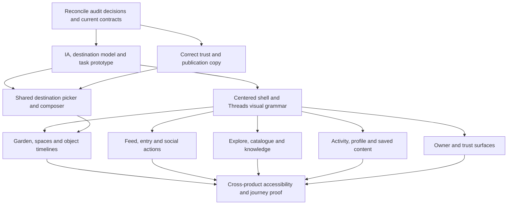

# Redesign sequencing and future Linear handoff

This document prepares later task creation. It creates no Linear issues, changes no existing status and does not claim to know the current Linear backlog. Before creating issues, read live Linear state and deduplicate against existing redesign work. Historical Done receipts are not evidence that these new acceptance criteria are satisfied.

## Dependency order

Accessibility requirements start with foundations; the last node is integrated proof, not a late accessibility retrofit.

## Work packages

| Package | Outcome | Findings / dependencies | Evidence needed |
|---|---|---|---|
| A. Decision alignment | Current canon reflects Threads priority, centered shell and many-destination creation | README owner decisions; ADR-0031/0028 reconciliation | Reviewed IA and contract diff, no stale reference conflicts |
| T. Trust consistency | All public statements match current visibility/media/deletion behavior | OG-UX-003/004/037; can begin immediately | Sentence-by-sentence UK/BG/RU factual reconciliation, disclosure version handling |
| B. Core journey prototype | Returning gardener can select any correct destination quickly | OG-UX-001/002/006/007/043; FAST_ENTRY.md | Realistic 100-object prototype tasks, wrong-destination/error observations |
| C. Foundation | One centered shell and coherent post/form/navigation grammar | OG-UX-005/009/014/031/040/041/042 | Responsive visual proof, keyboard/contrast/component states |
| D. Write | Global/contextual composer and all-destination picker | OG-UX-001/002/020/021/043; depends B/T | End-to-end controlled publish/edit/error proof, no duplicate or wrong destination |
| E. Garden | Clear collection, object timeline and space-level writing | OG-UX-006/007/008/019/023/026/045 | Many spaces/objects, direct context, return position, destructive separation |
| F. Read/social | Threads-style feed and coherent entry experience | OG-UX-010/014/015/016/017/018/029/030/041 | Media/text/date/language variants, social state and public-first rendering |
| G. Discovery | Useful search, catalogue, topic, knowledge and community paths | OG-UX-011/012/013/032/033/034/035 | Common-name and empty/large search tasks, source/experience distinction |
| H. Personal | Understandable activity, profile and saved content | OG-UX-022/024/025/036 | Duplicate-name reminder, ordinary-member role, saved/empty states |
| I. Owner/support | Task-focused operations, trust and recovery | OG-UX-037/038/039/040/044 | Populated queue fixtures, bounded errors, readable consequences |
| V. Integrated proof | No regression of product contracts; audit findings have receipts | All packages, ACCESSIBILITY.md | State/role/locale/viewport matrix, real keyboard/AT review, acknowledged server outcomes |

Package labels are planning containers, not a recommendation to make one enormous issue per package. Each implementation issue should deliver a coherent behavior and its verification. Findings can share an issue, but an issue should not mix unrelated user jobs simply because they reuse a component.

## Linear task shape

Use the repository's required sections exactly:

- Outcome
- Owner decisions this task implements
- Scope (in / out)
- Key files
- Acceptance criteria
- Proof
- Dependencies

Reference stable OG-UX IDs, include relevant screenshot links and the baseline, and make each acceptance criterion observable. Do not write “make modern,” “like Threads,” “fully accessible” or “reduce clicks” without a concrete scenario. Do not reuse old closed issues by naming them in a PR and accidentally reopening them.

## Product success measures

Primary: successful repeated observation in the intended existing object or space, measured to server acknowledgment. Guardrails: wrong destination, duplicate creation, lost input, failed publication, unreachable keyboard action and mistaken privacy expectation.

Secondary: time to find the target object; returning to the same object for a second observation; time to find a relevant public experience; ability to distinguish organism reference from owned object. Feed engagement alone is not sufficient evidence that the product's journal task improved.

Use qualitative task evidence first; add quantitative instrumentation only within current privacy/consent rules. Never log freeform journal text, personal object names or exact location just to calculate task success. No conversion lift, retention improvement or sample-based population claim is established by this audit.

## Definition of closed finding

1. Original condition reproduced or explicitly shown obsolete at a newer build.
2. New behavior implemented under current accepted contracts.
3. Acceptance scenario passes with representative data, roles and locales.
4. Relevant visual, keyboard, accessibility, error and server-outcome proof attached.
5. Current production evidence exists when the task scope includes release; local success and a merged PR are separate milestones.
6. Coverage gaps remain visible; do not erase historical evidence.

## Risks to control

A visual-only reskin will preserve wrong task boundaries. Copying Threads too literally can erase the plant/animal history model. Over-designing a destination picker into an arbitrary workspace tree can add more complexity than it removes. A one-object test fixture can conceal the exact scaling failure the owner identified. A broad simultaneous rewrite can break public addresses and static rendering. Separate these risks and validate the core journey before multiplying page implementations.
