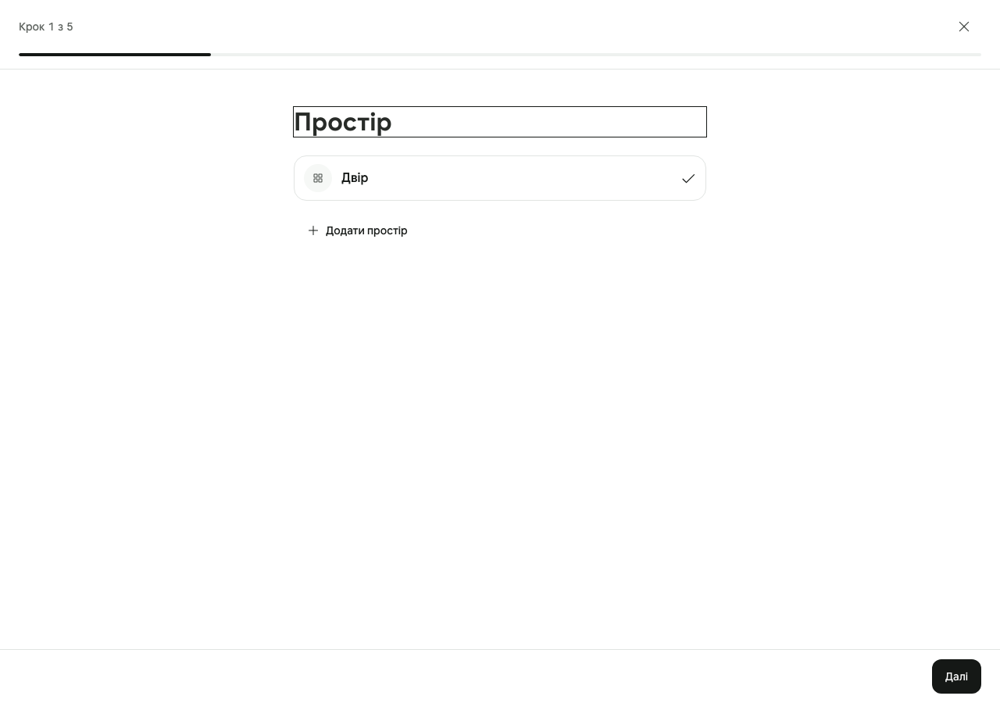
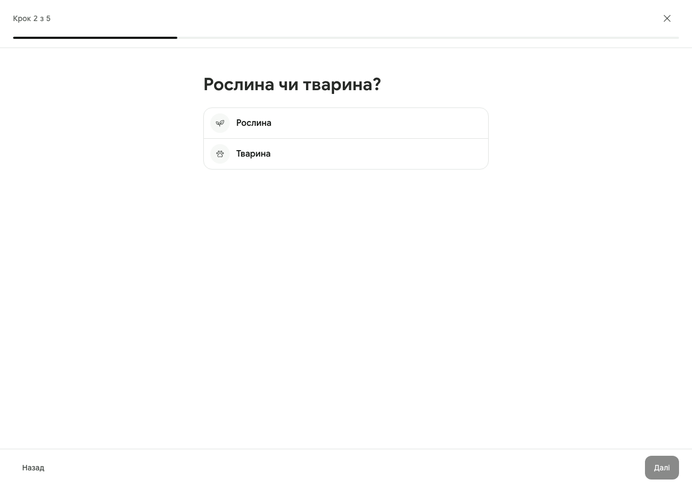
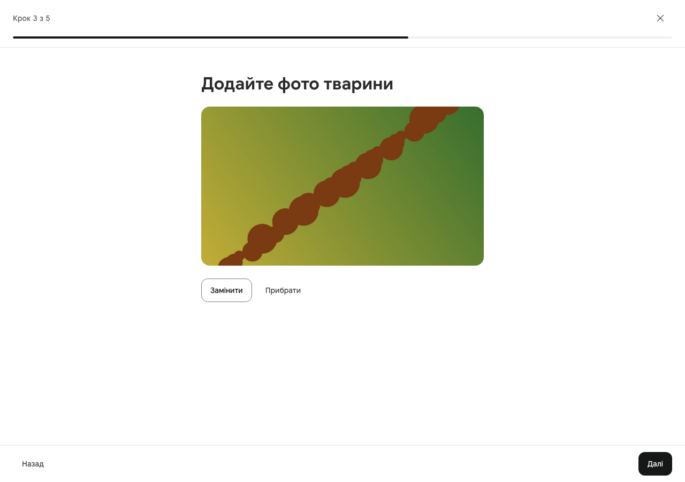
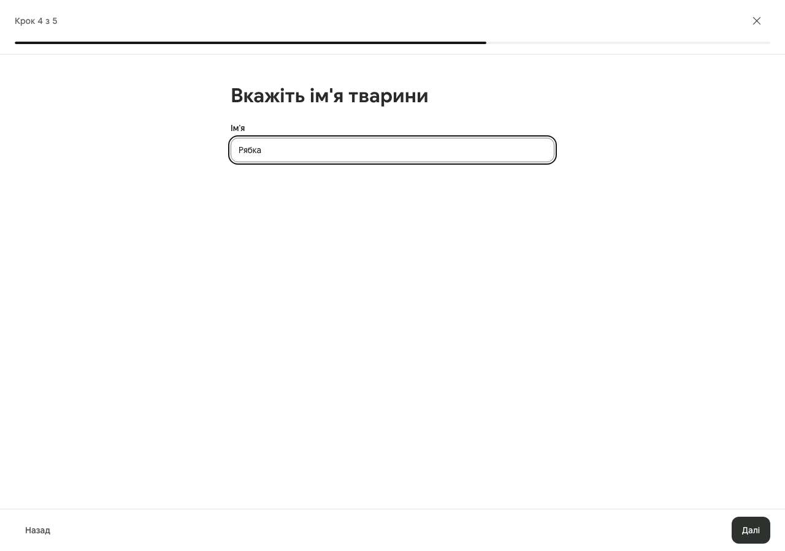
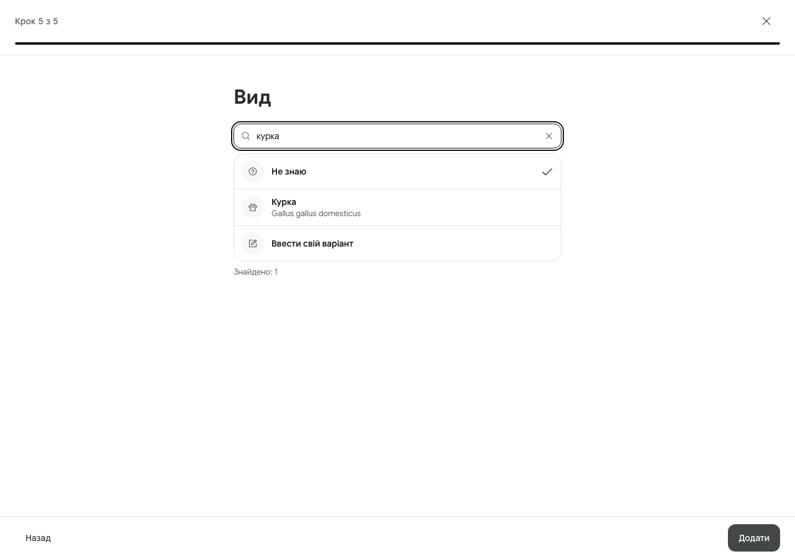
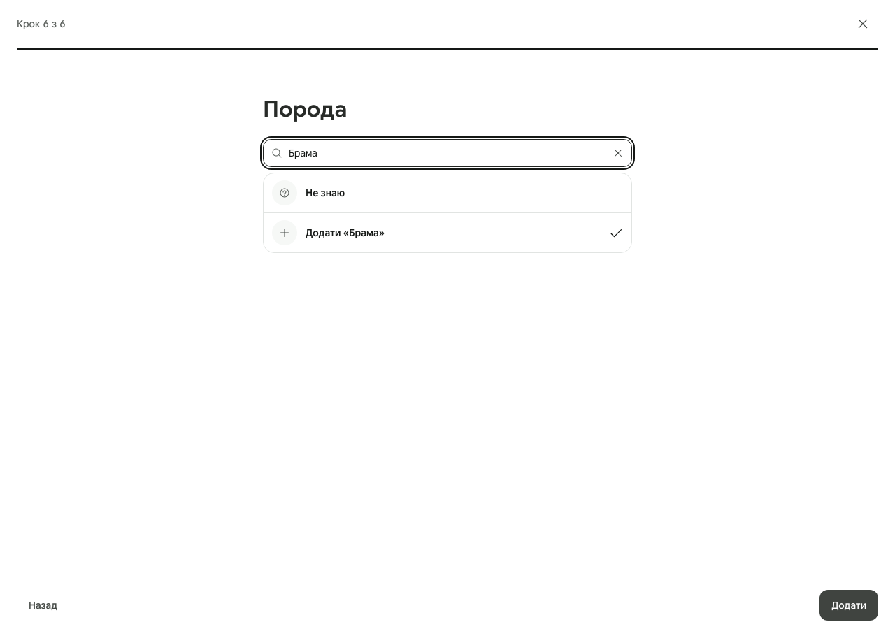
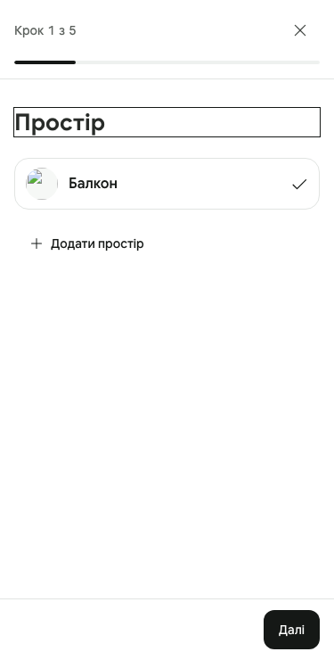
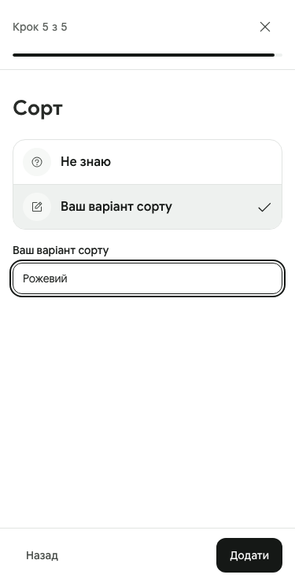

# OVE-524 — the object stepper: proof

Adding a plant or an animal is a full-screen stepper (ADR-0035 D1–D4,
`DESIGN.md` §5.24, §5.28): «Простір» → «Рослина чи тварина?» → an optional
photo with the crop editor → «Вкажіть ім'я …» → «Вид» → «Сорт» / «Порода» →
«Додати». Screenshots are from `tests/object-setup.spec.ts` on a production
build (`scripts/run-browser-gate.ts`), Ukrainian, with fixture photographs
whose stored files do not exist locally (the broken image on the object page
is that, not the page).

## The steps, beside their references

| Ours | Reference (Mobbin) | What is taken |
| --- | --- | --- |
|  | Airbnb, «What type of place will guests have?» — [602422da](https://mobbin.com/screens/602422da-e72d-4e16-a4a7-2d91d1b31447) | One question as the heading, the answers as rows, the chosen one marked, «Назад» / «Далі» at the bottom and a progress bar above. |
|  | Typeform, a choice answered with a check — [9e432697](https://mobbin.com/screens/9e432697-63a5-447c-8ace-cb78fc840711) | A single choice answers and moves on; the check marks the answer. |
|  | Airbnb, «Add some photos» — [cf0264f7](https://mobbin.com/screens/cf0264f7-185c-48c2-9875-78f62ff48bbc) | An optional photo as its own step, with «Пропустити» beside «Далі». The editor is 29.13's, unchanged. |
|  | Airbnb, «Now, let's give your apartment a title» — [a5b824a5](https://mobbin.com/screens/a5b824a5-9249-4a59-b6c5-76eeb2f554f6) | One text field under the question, no helper text. |
|  | Threads, search with results — [10e830a0](https://mobbin.com/screens/10e830a0-1ca3-4dfc-be7d-059b2585a0d5), [c524cf1f](https://mobbin.com/screens/c524cf1f-7cf4-4537-a4b6-c5a82c7ba6f0) | A search field over one surface of rows split by hairlines, a round glyph, the name in weight and one muted line (the Latin name) beneath. |
|  | Threads, a row chosen in a list — [da05c739](https://mobbin.com/screens/da05c739-5f67-46ac-804d-f8509f30f1bf) | The same rows, the chosen one marked at the row's end; the add row is the list's last row. |
|   | Airbnb, «Does every bedroom have a lock?» — [7118c3af](https://mobbin.com/screens/7118c3af-eea2-4cc0-8677-512ef60c3045) | At a phone's width: the rows fill it, the buttons stay at the bottom and above the keyboard (the frame follows the visual viewport). |

The object it made: 

## What each spec proves

`tests/object-setup.spec.ts` (8 tests, green on a production build):

- **The full run**: «Тварина» → a photo cropped and turned → «Рябка» →
  «курка» found by that word, with its Latin name → «Брама» typed and added →
  «Додати». The request carries the staged photo's receipts (16:9 after the
  crop); the object points at one shared, unreviewed breed entry; the photo
  the claim would write is the passport's cover. A second gardener, started
  inside a space («Крок 1 з 4»), sees «Брама» on the chicken's list without
  typing, and picks the same entry.
- **No space**: `/garden/objects/new` goes to the space stepper; leaving it
  goes home (no loop); creating one comes back to step 1 with it chosen.
- **One space with a photo**: chosen, shown with its photo, «Далі» and
  «Додати простір»; that link comes back with the new space chosen.
- **«Не знаю», own species, own cultivar, Back, 375 px**: «Не знаю» drops
  «Сорт» from the count («Крок 4 з 4») and creates an object with nothing
  guessed; Back keeps the name; «Ввести свій варіант» opens a focused field,
  «Сорт» becomes «Не знаю» or a private text; a base species opens «Сорт» on
  «Не знаю» and «Додати» works untouched. With the viewport shrunk as by a
  keyboard, «Далі» stays in view.
- **The species search**: «полуниця», «болгарський перець», «кабачок» find
  their species first; a catalogue species outside the base is found by
  nothing; Enter with nothing highlighted takes nothing, arrows then Enter
  take the row; a search answering 503 says so and «Не знаю» and the own
  variant still work.
- **The cultivar list**: a cultivar some object uses is offered, a registered
  one nobody uses is not; «бичаче серце» leads with «Бичаче серце» and offers
  no add row; a typo still finds it; picking it creates no entry.
- **Settings**: an object without a photo gets one (the cover at once), then
  a second replaces it, then «Прибрати» removes it through the real route with
  its files queued for revocation.
- **The endpoint**: one object per intent; one entry for «Кохінхін» and
  «кохінхін» from two gardeners; a species outside the base, of the other
  kind, another species' entry, a cultivar without a species and an
  over-long own species are each refused with their status; the list route
  is `no-store` and refuses a guest.

Specs adjusted to the stepper: `catalog-picker` (the three outcomes and the
503 through «Вид» and «Сорт»), `consent-and-erasure` (the tab bar is gone
under a stepper and the cookie notice stays answerable over it),
`owned-destinations`, `redesign-baselines`, `space-page`.

## Database

`pnpm schema:object-species:prove-database` (CI) on a disposable database:
the label moves to the own species; 9 CHECK refusals; the key fixture agrees
in SQL and TypeScript (16 cases); replaying 0086 changes nothing; the writer's
entry, reuse, list, concurrency (two adds of «Кохінхін» at once → one entry),
refusals, address and page, erasure; the object photo; the first species
search on five fresh backends; every migration replayed over the new rows;
the rollback and re-apply. `scripts/prove-migration-reapply.ts --passes 3`
passes on an empty database.

**The rolled-back run on production** (2026-09-26, one transaction ending in
`ROLLBACK`): before, `free_text` 10 / `selected` 162 (all linked) /
`unknown` 9; after, `selected` 162 (a fingerprint of every linked row
unchanged) / `unknown` 19, 10 own species (one text: the launch smoke's
label); the three CHECKs, the key folding «Черокі» and «ЧЕРОКИ», the
gardeners' snapshot, the per-gardener index gone; 303 ms; nothing left after
the rollback.

## The first search

On 2026-09-25 the first three animal searches against production answered
503. Measured on production on 2026-09-26 through unpooled connections, so
each sample is a fresh database backend:

| Statement | Fresh backend | Warm |
| --- | --- | --- |
| The whole catalogue (`/api/public/catalog/typeahead`, «курка», animal) | planning 89.6 ms + execution 277 ms (EXPLAIN); up to 317 ms from the client | execution 162–187 ms, 2,242 buffers |
| The base alone (`/api/public/catalog/species`) | about 60 ms from the client, most of it the round trip | execution 3.8–4.3 ms, 1,146 buffers |

The species step reads the base alone — 5,627 plant and 1,077 animal names —
so no query can make it long, and its deadline is 1,000 ms against the whole
picker's 400. The measurement of the route itself after the deploy follows the
deployment, which waits for Vercel.
